# รายงานฉบับสมบูรณ์ (ปิดโครงการวิจัย)

## ชื่อโครงการ
**อุปกรณ์ตรวจสอบโซ่ด้วยเทคโนโลยีคอมพิวเตอร์วิทัศน์และการเรียนรู้เชิงลึก**
*(Chain Inspection Device using Computer Vision and Deep Learning Technology)*

| หัวข้อ | รายละเอียด |
|---|---|
| ผู้วิจัย | นายศิวกร สุขประเสริฐชัย และคณะ |
| หน่วยงาน | คณะพาณิชยนาวีนานาชาติ มหาวิทยาลัยเกษตรศาสตร์ วิทยาเขตศรีราชา ชลบุรี 20230 |
| แหล่งทุน | ทุนอุดหนุนวิจัยและนวัตกรรม ตามยุทธศาสตร์ มก. วิทยาเขตศรีราชา ประจำปีงบประมาณ 2568 |
| งบประมาณ | 292,500 บาท |
| ระยะเวลา | 1 ปี (16 ธ.ค. 2567 – 15 ธ.ค. 2568) |

---

## บทคัดย่อ

โซ่รับแรง เช่น โซ่สมอเรือ (anchor chain) และโซ่ผูกยึด (mooring chain) เป็นชิ้นส่วนวิกฤต
ด้านความปลอดภัยที่ต้องได้รับการตรวจสอบสภาพการสึกกร่อน (wear) และการกัดกร่อน (corrosion)
อย่างสม่ำเสมอตามข้อกำหนดของสมาคมการจัดชั้นเรือสากล (International Association of Classification
Societies, IACS) ซึ่งกำหนดเกณฑ์การปลดระวางเมื่อขนาดเส้นผ่านศูนย์กลางเฉลี่ยที่ตำแหน่งสึกกร่อน
ลดลงเกิน 12% ของขนาดดั้งเดิม การตรวจสอบในปัจจุบันยังพึ่งพาแรงงานคนและเครื่องมือวัดสัมผัส
(เวอร์เนียร์คาลิปเปอร์) เป็นหลัก ทำให้สิ้นเปลืองเวลาและมีความไม่สม่ำเสมอระหว่างผู้ตรวจ

โครงการนี้พัฒนาต้นแบบระบบตรวจสอบโซ่อัตโนมัติบนบก (on-shore) โดยผสานเทคโนโลยี
คอมพิวเตอร์วิทัศน์ (Computer Vision) และการเรียนรู้เชิงลึก (Deep Learning) บนชุดประมวลผล
ขอบ (edge computing) NVIDIA Jetson การดำเนินงานแบ่งเป็นสองแนวทาง แนวทางแรกใช้
โครงข่ายตรวจจับวัตถุ YOLOv8 ตรวจจับการกัดกร่อนเชิงคุณภาพ (mAP@50 = 63.9%) และแนวทางที่สอง
ซึ่งเป็นผลลัพธ์หลักของโครงการ คือการวัดการสึกกร่อนเชิงเรขาคณิต (geometry-based wear measurement)
ด้วยกระบวนการ 8 ขั้นตอน ตั้งแต่การแบ่งส่วนภาพด้วย FastSAM การแก้เพอร์สเปกทีฟ การสร้างแบบจำลอง
ข้อโซ่แนวตั้งด้วยจุดควบคุม 12 จุด (พื้นที่ A) การสร้างแบบจำลองวงกลมลวดแนวนอน (พื้นที่ B) และการวัด
การสึกกร่อนจากอัตราส่วนพื้นที่ซ้อนทับ $\text{Wear} = \text{area}(A\cap B)/\text{area}(A)$ พร้อมการชดเชย
พารัลแลกซ์ (parallax normalization)

ผลการทดสอบกับตัวอย่างโซ่ 3 ระดับการสึกกร่อน ให้ลำดับการสึกกร่อนที่ถูกต้องตรงตามกายภาพ
(ใหม่ 18.8% < 24.3% < 31.9%) สอดคล้องกับค่าอ้างอิงจากเวอร์เนียร์คาลิปเปอร์ (ใหม่ < 30% < 50%)
และการชดเชยพารัลแลกซ์ลดการกระจายของค่าภายในเฟรมเดียวจาก ~10 จุดเปอร์เซ็นต์เหลือ ~1.5
จุดเปอร์เซ็นต์ ผลงานนี้แสดงให้เห็นความเป็นไปได้ของการตรวจวัดการสึกกร่อนเชิงปริมาณด้วยภาพเดี่ยว
(monocular) และวางรากฐานสำหรับการต่อยอดสู่ระบบสเตอริโอวิชันและการรายงานผลตามนิยาม IACS
โดยตรงในระยะต่อไป

**คำสำคัญ:** การตรวจสอบโซ่, การสึกกร่อน, คอมพิวเตอร์วิทัศน์, การเรียนรู้เชิงลึก, การแบ่งส่วนภาพ,
IACS, YOLOv8, FastSAM

---

## Abstract

Load-bearing chains such as anchor chains and mooring chains are safety-critical
components that must be regularly inspected for wear and corrosion in accordance with
the requirements of the International Association of Classification Societies (IACS),
which mandates replacement once the mean diameter at the worn section drops more than
12% below the original gauge. Current inspection still relies mainly on manual labour
and contact gauges (vernier calipers), which is time-consuming and inconsistent between
inspectors.

This project develops an on-shore automated chain-inspection prototype that combines
Computer Vision and Deep Learning on an NVIDIA Jetson edge-computing module. Two
approaches were pursued. The first uses the YOLOv8 object detector for qualitative
corrosion detection (mAP@50 = 63.9%). The second — the project's principal result — is a
geometry-based wear measurement realised through an 8-stage pipeline: FastSAM
segmentation, perspective correction, a 12-control-point vertical-link model (area A), a
horizontal-wire circle model (area B), and a wear metric defined as the overlap ratio
$\text{Wear} = \text{area}(A\cap B)/\text{area}(A)$, together with a parallax-normalization
step.

On three chain samples spanning different wear states, the method produced a
physically correct wear ordering (new 18.8% < 24.3% < 31.9%), consistent with the
caliper ground truth (new < 30% < 50%), while parallax normalization reduced
within-frame scatter from ~10 to ~1.5 percentage points. The work demonstrates the
feasibility of quantitative monocular wear measurement and lays the groundwork for a
future stereo-vision extension reporting directly against the IACS criterion.

**Keywords:** chain inspection, wear, computer vision, deep learning, image
segmentation, IACS, YOLOv8, FastSAM

---

## สารบัญ (โครงเรื่อง)

- **บทที่ 1** บทนำ — หลักการและเหตุผล วัตถุประสงค์ ขอบเขต ประโยชน์ที่คาดว่าจะได้รับ
- **บทที่ 2** การทบทวนวรรณกรรมและทฤษฎีที่เกี่ยวข้อง — มาตรฐาน IACS, NDT/MFL, การประมวลผลภาพ,
  การเรียนรู้เชิงลึก, foundation models, การวัดด้วยภาพ, เรขาคณิตหลายมุมมอง
- **บทที่ 3** วิธีการดำเนินงานวิจัย — ฮาร์ดแวร์ แนวทาง YOLOv8 การ pivot และกระบวนการวัด 8 ขั้นตอน
- **บทที่ 4** ผลการทดลองและการอภิปราย — ผล YOLO, การแบ่งส่วน, ผลการวัดต่อขั้นตอน, การชดเชยพารัลแลกซ์,
  การเปรียบเทียบกับค่าจริง, ข้อจำกัด
- **บทที่ 5** สรุปผล ข้อเสนอแนะ และแผนระยะต่อไป
- **เอกสารอ้างอิง** และ **ภาคผนวก**

---

# บทที่ 1 บทนำ

## 1.1 หลักการและเหตุผล

โซ่ (chain) เป็นชิ้นส่วนรับแรงดึงที่ใช้อย่างแพร่หลายในงานทางทะเลและพาณิชยนาวี โดยเฉพาะ
**โซ่สมอเรือ (anchor chain)** และ **โซ่ผูกยึดทุ่น/แท่น (mooring chain)** ซึ่งต้องรับภาระแบบพลวัต
(dynamic loading) ตลอดอายุการใช้งาน ประกอบกับการสัมผัสพื้นทะเล การกัดกร่อนจากน้ำทะเล และ
การเสียดสีระหว่างข้อโซ่ ทำให้เกิดการสึกกร่อนสะสมที่ตำแหน่งสัมผัส (interlock) ระหว่างข้อโซ่
สองข้อที่คล้องกัน หากการสึกกร่อนลุกลามจนขนาดหน้าตัดลดลงมากเกินไป ความสามารถในการรับแรง
จะลดลงอย่างมีนัยสำคัญและอาจนำไปสู่การขาดของโซ่ ซึ่งเป็นอุบัติเหตุร้ายแรงต่อชีวิตและทรัพย์สิน

องค์กรจัดชั้นเรือภายใต้ **สมาคมการจัดชั้นเรือสากล (International Association of Classification
Societies, IACS)** จึงกำหนดข้อบังคับให้ตรวจสอบโซ่สมอและอุปกรณ์ผูกยึดเป็นระยะ (annual survey
และ special periodical survey ทุก 5 ปี) โดยหนึ่งในเกณฑ์เชิงปริมาณที่สำคัญคือ **การวัดขนาด
เส้นผ่านศูนย์กลางของข้อโซ่ที่ตำแหน่งสึกกร่อน** เทียบกับขนาดดั้งเดิม [1], [2] ตามหลักการ

$$ \bar{D} = \tfrac{d_1 + d_2}{2}, \qquad \bar{D} \ge 0.88\,D_0 $$

เมื่อ $D_0$ คือขนาดเส้นผ่านศูนย์กลางดั้งเดิมของโซ่ และ $d_1, d_2$ คือขนาดที่วัดได้ในสองแนวตั้งฉาก
ณ ตำแหน่งสึกกร่อน กล่าวคือ **หากการสึกกร่อนเกิน 12% ของขนาดดั้งเดิม โซ่ต้องถูกปลดระวาง**
รูปที่ 1.1 แสดงหลักการของเกณฑ์นี้

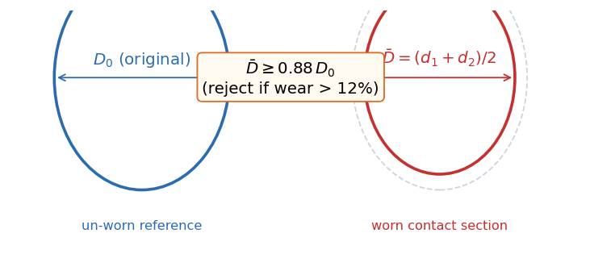

*รูปที่ 1.1 เกณฑ์การสึกกร่อนของ IACS: โซ่ต้องถูกปลดระวางเมื่อ $\bar D < 0.88\,D_0$ (สึกกร่อนเกิน 12%)
[1], [2] (จัดทำโดยคณะผู้วิจัย)*

ในทางปฏิบัติ การตรวจสอบเบื้องต้น (initial/close-up survey) ยังคงพึ่งพาแรงงานคนในการมองด้วยตา
(visual inspection) และวัดขนาดด้วยเครื่องมือสัมผัส เช่น เวอร์เนียร์คาลิปเปอร์ หรือแหวนวัด (go/no-go
gauge) ทีละข้อ วิธีนี้มีข้อจำกัดสำคัญคือ (ก) ใช้เวลาและกำลังคนสูงเนื่องจากโซ่สมอมีความยาวหลาย
ร้อยเมตรและต้องคลี่วางเรียง (ranging) ทั้งเส้น (ข) ผลการประเมินขึ้นกับประสบการณ์และความล้าของ
ผู้ตรวจ ทำให้เกิดความไม่สม่ำเสมอ (inter-inspector variability) และ (ค) การเข้าถึงตำแหน่งสัมผัสที่สึก
จริงทำได้ยากเพราะถูกข้อโซ่ที่คล้องกันบดบัง

ด้วยความก้าวหน้าของ **คอมพิวเตอร์วิทัศน์ (Computer Vision)** และ **การเรียนรู้เชิงลึก (Deep
Learning)** ในทศวรรษที่ผ่านมา งานตรวจสอบสภาพโครงสร้างโลหะเชิงอัตโนมัติได้รับความสนใจอย่างมาก
ทั้งการตรวจจับการกัดกร่อนบนสะพานเหล็ก เสาส่งไฟฟ้า และโครงสร้างไฮดรอลิก [9], [10], [12], [22]
ตลอดจนการตรวจสอบลวดสลิง (wire rope) ด้วยการรวมสัญญาณสนามแม่เหล็กรั่วไหลกับภาพ [13], [14], [15]
โครงการนี้จึงมุ่งพัฒนาต้นแบบระบบตรวจสอบโซ่อัตโนมัติที่ประมวลผลบนชุด edge computing (NVIDIA
Jetson) [21] เพื่อลดการพึ่งพาแรงงานคน เพิ่มความสม่ำเสมอ และวางรากฐานสู่การตรวจสอบเชิงปริมาณ
ที่ทวนสอบย้อนกลับได้

## 1.2 ปัญหาการวิจัยและช่องว่างขององค์ความรู้

งานตรวจจับการกัดกร่อนด้วยการเรียนรู้เชิงลึกส่วนใหญ่ให้ผลลัพธ์ **เชิงคุณภาพ** (มี/ไม่มีการกัดกร่อน
หรือกรอบขอบเขต/มาสก์ของบริเวณสนิม) [9], [11], [12] ซึ่งแม้จะมีประโยชน์ในการคัดกรอง แต่ยัง
**ไม่สามารถให้ค่าปริมาณการสึกกร่อนเป็นเปอร์เซ็นต์** ที่นำไปเทียบกับเกณฑ์เชิงมิติ (dimensional) ของ
IACS ได้โดยตรง นอกจากนี้ "สนิม/การกัดกร่อนที่ผิว" (surface corrosion) กับ "การสึกหรอที่ทำให้ขนาด
ลดลง" (dimensional wear) เป็นคนละปรากฏการณ์ทางวิศวกรรม โดยเกณฑ์ความปลอดภัยของ IACS
อ้างอิงกับ *ขนาดที่หายไป* ไม่ใช่พื้นที่สนิมบนผิว ช่องว่างขององค์ความรู้จึงอยู่ที่ **การวัดการสึกกร่อน
เชิงมิติจากภาพให้เป็นค่าปริมาณที่สอดคล้องกับมาตรฐาน**

## 1.3 วัตถุประสงค์ของโครงการ

1. ออกแบบและพัฒนาระบบตรวจจับการกัดกร่อน (สนิม/รอยร้าว) ด้วย Deep Learning
2. ออกแบบและพัฒนาระบบวัดการสึกกร่อนด้วย Computer Vision
3. ลดจำนวนคนและเวลาในการตรวจสอบโซ่เบื้องต้น
4. เผยแพร่ผลงานวิจัยในวารสารวิชาการระดับชาติ/นานาชาติ
5. บูรณาการเทคโนโลยีดิจิทัลและปัญญาประดิษฐ์กับอุตสาหกรรมทางทะเลและพาณิชยนาวี

> **หมายเหตุเชิงนโยบายของโครงการ:** ในระหว่างการดำเนินงาน คณะผู้วิจัยได้ **ปรับจุดเน้น (pivot)**
> จากวัตถุประสงค์ข้อ 1 (การตรวจจับการกัดกร่อนเชิงคุณภาพ) ไปสู่วัตถุประสงค์ข้อ 2
> **(การวัดการสึกกร่อนเชิงกายภาพ/เชิงปริมาณ)** เป็นผลลัพธ์หลักของโครงการ ด้วยเหตุผลที่อธิบายไว้ใน
> หัวข้อ 3.4 เนื่องจากการวัดการสึกกร่อนเป็นตัวชี้วัดเชิงปริมาณที่สอดคล้องกับเกณฑ์ IACS 12% โดยตรง
> และเป็นข้อมูลที่ใช้ตัดสินใจ (go/no-go) ได้จริง

## 1.4 ขอบเขตของการวิจัย

- ตัวอย่างทดสอบเป็น **โซ่แบบไม่มีสตัด (open-link/stud-less)** ขนาด 10×25 มม. จำนวน 3 ระดับการ
  สึกกร่อน (ใหม่, ~30%, ~50%) ถ่ายภาพในสภาพห้องปฏิบัติการ
- ระบบทำงานแบบ **ภาพเดี่ยว (monocular)** มุมมองด้านบน โดยออกแบบฮาร์ดแวร์รองรับการต่อยอด
  สู่สเตอริโอวิชัน
- การประเมินความถูกต้องใช้ค่าอ้างอิงจาก **เวอร์เนียร์คาลิปเปอร์** เป็น ground truth
- ขอบเขต **ไม่รวม** การตรวจสอบใต้น้ำ (subsea) และการทดสอบภาระเชิงกล (proof load test)

## 1.5 ประโยชน์ที่คาดว่าจะได้รับ

1. ต้นแบบระบบตรวจวัดการสึกกร่อนของโซ่เชิงปริมาณที่ทวนสอบได้ ลดการพึ่งพาแรงงานคน
2. องค์ความรู้ด้านการวัดเชิงมิติด้วยภาพ (vision-based metrology) สำหรับชิ้นส่วนที่มีการบดบังกันเอง
3. รากฐานฮาร์ดแวร์/ซอฟต์แวร์สำหรับต่อยอดสู่ระบบตรวจสอบแบบเวลาจริงบนสายการผลิต/สายตรวจสอบ
4. การบูรณาการปัญญาประดิษฐ์กับอุตสาหกรรมพาณิชยนาวีของประเทศ

---

# บทที่ 2 การทบทวนวรรณกรรมและทฤษฎีที่เกี่ยวข้อง

บทนี้ทบทวนงานวิจัยและทฤษฎีพื้นฐานใน 7 กลุ่มที่เกี่ยวข้องกับระบบที่พัฒนา ได้แก่ (2.1) มาตรฐานและ
เกณฑ์การตรวจสอบโซ่, (2.2) การตรวจสอบแบบไม่ทำลายของโซ่/ลวดสลิง, (2.3) การประมวลผลภาพ
เชิงเรขาคณิตพื้นฐาน, (2.4) การเรียนรู้เชิงลึกและการตรวจจับวัตถุ, (2.5) แบบจำลองพื้นฐานสำหรับการ
แบ่งส่วนภาพ, (2.6) การวัดขนาดเชิงมิติด้วยภาพ, และ (2.7) เรขาคณิตหลายมุมมองและพารัลแลกซ์

## 2.1 มาตรฐานและเกณฑ์การตรวจสอบโซ่ (IACS)

IACS เป็นองค์กรความร่วมมือของสมาคมจัดชั้นเรือชั้นนำของโลก ทำหน้าที่กำหนดข้อบังคับเชิงเทคนิค
(Unified Requirements, UR) และข้อแนะนำ (Recommendations, Rec.) สำหรับการต่อเรือและการ
ตรวจสอบเรือ ในส่วนที่เกี่ยวกับอุปกรณ์สมอและการผูกยึด เอกสาร **IACS Rec. No. 10 — Anchoring,
Mooring and Towing Equipment** [1] และ **UR A1/A2** [2] ระบุขั้นตอนการตรวจสอบ ได้แก่ การวัด
ขนาดข้อโซ่ การตรวจการบิดเบี้ยว/รอยร้าว การประเมินการกัดกร่อนแบบรูพรุน (pitting) และสภาพสตัด
(stud) เกณฑ์เชิงมิติที่ใช้กันทั่วไปคือ **การยอมรับ/ปฏิเสธโซ่จากอัตราการสูญเสียเส้นผ่านศูนย์กลาง**
โดยค่าที่ใช้อ้างอิงบ่อยคือ **12% ของขนาดดั้งเดิม** (สอดคล้องกับแนวทางการพิจารณาเปลี่ยนหมุด/พิน
เมื่อสึกถึง 12% ของเส้นผ่านศูนย์กลาง) [1]

ประเด็นสำคัญคือ เกณฑ์นี้เป็น **เกณฑ์เชิงมิติ (dimensional)** ไม่ใช่เชิงพื้นที่ผิว การออกแบบระบบวัด
จึงต้องให้ผลลัพธ์เป็น *ขนาด/สัดส่วนที่หายไป* เพื่อให้เทียบกับมาตรฐานได้โดยตรง — เป็นเหตุผลหลักที่
โครงการปรับแนวทางไปสู่การวัดเชิงเรขาคณิต (บทที่ 3)

## 2.2 การตรวจสอบแบบไม่ทำลายของโซ่และลวดสลิง (NDT)

การตรวจสอบชิ้นส่วนโลหะรับแรงแบบไม่ทำลาย (Non-Destructive Testing, NDT) มีหลายเทคนิค
สำหรับลวดสลิงและสายเคเบิลเหล็ก เทคนิคที่ใช้แพร่หลายที่สุดคือ **การรั่วไหลของสนามแม่เหล็ก
(Magnetic Flux Leakage, MFL)** ซึ่งตรวจจับความผิดปกติเฉพาะที่ (local flaw เช่น ลวดขาด) และ
การสูญเสียหน้าตัดโลหะ (loss of metallic cross-sectional area) ในโครงสร้างเฟอร์โรแมกเนติก [13], [15]
งานวิจัยล่าสุดผสาน MFL กับการประมวลผลภาพและการเรียนรู้เชิงลึก เช่น การแปลงสัญญาณ MFL เป็น
ภาพแล้วใช้โครงข่าย YOLOv9 ตรวจจับตำแหน่งข้อบกพร่อง [14] หรือใช้ 1D-CNN วิเคราะห์สัญญาณ MFL
โดยตรง [15] และการหลอมรวมข้อมูล MFL กับข้อมูลแสงที่มองเห็นได้ (visible light) เพื่อจำแนกลวดขาด
เชิงปริมาณ [13]

ข้อจำกัดของ MFL คือ ต้องอาศัยหัวตรวจสัมผัส/ใกล้ชิ้นงานและแม่เหล็กกำลังสูง เหมาะกับลวดสลิงที่
เคลื่อนผ่านหัวตรวจ แต่ไม่สะดวกสำหรับการวัด *ขนาดทางเรขาคณิต* ของข้อโซ่ขนาดใหญ่ที่ต้องการ
ประเมินสัดส่วนการสึกกร่อนตามเกณฑ์ IACS งานตรวจสอบด้วยภาพ (vision-based) จึงเป็นแนวทางเสริม
ที่ให้ข้อมูลเชิงมิติได้โดยตรงและไม่ต้องสัมผัสชิ้นงาน

## 2.3 การประมวลผลภาพเชิงเรขาคณิตพื้นฐาน

ระบบที่พัฒนาใช้เครื่องมือประมวลผลภาพคลาสสิกหลายชนิดในการสกัดขอบและรูปทรงจากมาสก์
การแบ่งส่วน โดยอ้างอิงทฤษฎีมาตรฐานด้านการประมวลผลภาพดิจิทัล [18]

- **การกำหนดขีดแบ่ง (Thresholding):** การแปลงภาพระดับเทาเป็นภาพไบนารีด้วยขีดแบ่ง วิธีอัตโนมัติ
  ที่ใช้อ้างอิงคือวิธีของ Otsu ซึ่งเลือกขีดแบ่งที่ทำให้ความแปรปรวนระหว่างคลาสสูงสุด [19]
- **การติดป้ายองค์ประกอบเชื่อมต่อ (Connected-Component Labelling):** ใช้แยกวัตถุ (blob) ออกจาก
  กันเพื่อคัดเลือกข้อโซ่/ลวดที่สนใจและกำจัดสัญญาณรบกวนขนาดเล็ก [18]
- **การหาเส้นขอบและพื้นที่ (Contour & Area):** ใช้อัลกอริทึมติดตามขอบของ Suzuki–Abe [20]
  (มีในไลบรารี OpenCV) ในการดึงรูปหลายเหลี่ยมปิด และคำนวณพื้นที่ด้วย **สูตร Shoelace (Gauss's
  area formula)** ซึ่งให้พื้นที่ของรูปหลายเหลี่ยมจากพิกัดจุดยอด เป็นหัวใจของการหาพื้นที่ $A$, $B$
  และ $A\cap B$

**สูตร Shoelace** สำหรับรูปหลายเหลี่ยมที่มีจุดยอด $(x_i, y_i)$:

$$ \text{Area} = \tfrac{1}{2}\left| \sum_{i=1}^{n} (x_i y_{i+1} - x_{i+1} y_i) \right| $$

- **เส้นโค้งเบซิเยร์ (Bézier curves):** ใช้สร้างส่วนโค้งปลายข้อโซ่ที่ถูกบดบัง (occluded cap) ขึ้นใหม่
  จากจุดควบคุม เส้นโค้งเบซิเยร์กำลังสอง (quadratic) นิยามด้วยจุดควบคุมสามจุด $P_0, P_1, P_2$:

$$ C(t) = (1-t)^2 P_0 + 2(1-t)t\,P_1 + t^2 P_2, \quad t \in [0,1] $$

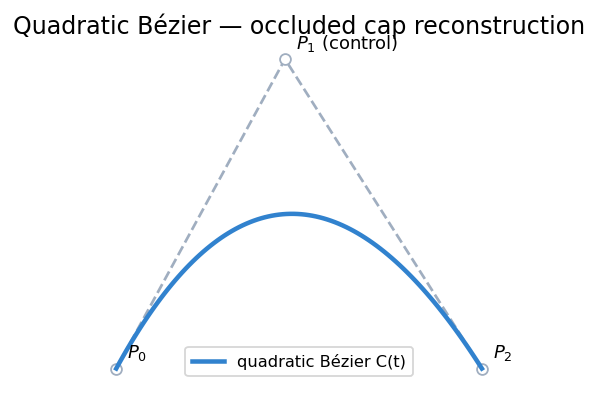

*รูปที่ 2.1 เส้นโค้งเบซิเยร์กำลังสองที่ใช้สร้างปลายข้อโซ่ที่ถูกบดบังขึ้นใหม่ จากจุดควบคุม
$P_0, P_1, P_2$ (จัดทำโดยคณะผู้วิจัย)*

## 2.4 การเรียนรู้เชิงลึกและการตรวจจับวัตถุ

**โครงข่ายประสาทเทียมแบบคอนโวลูชัน (Convolutional Neural Network, CNN)** เป็นสถาปัตยกรรมหลัก
ของงานวิทัศน์สมัยใหม่ สำหรับงานตรวจจับวัตถุ (object detection) ที่ต้องระบุทั้งตำแหน่งและชนิดของ
วัตถุพร้อมกัน ตระกูล **YOLO (You Only Look Once)** ที่เสนอโดย Redmon และคณะ (2016) [5] เป็น
วิธีที่ได้รับความนิยมสูงเนื่องจากประมวลผลทั้งภาพในครั้งเดียว (single-stage) ทำให้ทำงานแบบเวลาจริง
ได้ YOLO แบ่งภาพเป็นกริดและทำนายกรอบขอบเขต (bounding box) พร้อมความน่าจะเป็นของคลาส
โดยตรงจากแต่ละเซลล์

รุ่นล่าสุดในตระกูลนี้ที่โครงการเลือกใช้คือ **YOLOv8** โดย Ultralytics (2023) [6] ซึ่งปรับสถาปัตยกรรม
เป็นแบบ *anchor-free* และใช้ decoupled head แบ่งการทำนายตำแหน่งและคลาสออกจากกัน ทำให้จัดการ
วัตถุขนาดเล็กและซ้อนทับได้ดีขึ้น สถาปัตยกรรมประกอบด้วย 3 ส่วนคือ backbone (สกัดคุณลักษณะ),
neck (รวมคุณลักษณะหลายสเกลด้วย PANet) และ head (ทำนายผล)

ในบริบทการตรวจจับการกัดกร่อน มีงานวิจัยจำนวนมากประยุกต์ใช้ CNN/YOLO อย่างได้ผล เช่น
Corrosion-YOLOv5s สำหรับจำแนกการกัดกร่อนของโลหะ [11], การแบ่งส่วนการกัดกร่อนของเหล็กแบบ
เวลาจริงด้วยโมเดล semantic/instance segmentation [10], การประเมินการกัดกร่อนบนเสาส่งไฟฟ้าด้วย
ภาพจากอากาศยานไร้คนขับ (UAV) ร่วมกับ DCNN [22] และบทปริทัศน์ที่รวบรวมเทคนิคและความ
ท้าทายของการเรียนรู้เชิงลึกในงานประเมินการกัดกร่อน [9], [12] งานเหล่านี้ให้ผลลัพธ์เชิงคุณภาพ
(ตำแหน่ง/ระดับการกัดกร่อน) เป็นหลัก ซึ่งสอดคล้องกับผลของแนวทางแรกในโครงการนี้ (หัวข้อ 3.3)

## 2.5 แบบจำลองพื้นฐานสำหรับการแบ่งส่วนภาพ (Segmentation Foundation Models)

จุดเปลี่ยนสำคัญของงานแบ่งส่วนภาพเกิดขึ้นในปี 2023 เมื่อ Meta AI เผยแพร่ **Segment Anything Model
(SAM)** [3] ซึ่งเป็นแบบจำลองพื้นฐาน (foundation model) ที่ฝึกบนชุดข้อมูล SA-1B (ภาพ 11 ล้านภาพ
พร้อมมาสก์ 1.1 พันล้านมาสก์) ทำให้สามารถแบ่งส่วนวัตถุที่ไม่เคยเห็นมาก่อนได้แบบ zero-shot ด้วย
พรอมต์ (จุด/กรอบ) จุดเด่นคือคุณภาพมาสก์สูงและครอบคลุมวัตถุหลากหลายโดยไม่ต้องฝึกเฉพาะงาน

อย่างไรก็ตาม SAM มีต้นทุนการคำนวณสูงเนื่องจากใช้ image encoder แบบ Vision Transformer ขนาดใหญ่
ไม่เหมาะกับการทำงานแบบเวลาจริงบนอุปกรณ์ขอบ **FastSAM** โดย Zhao และคณะ (2023) [4] จึงเสนอ
แนวทางที่ใช้ CNN (บนพื้นฐานของ YOLOv8-seg) ฝึกบนข้อมูลเพียง 2% ของ SAM เดิม แต่ให้ผลลัพธ์
ใกล้เคียงและเร็วกว่าถึงราว 50 เท่า เหมาะสำหรับการแบ่งส่วนแบบเวลาจริง โครงการนี้เลือกใช้ FastSAM
เป็นตัวแบ่งส่วนหลักบน NVIDIA Jetson และมี SAM เป็นทางเลือกสำรองสำหรับกรณีที่ต้องการคุณภาพสูงสุด

## 2.6 การวัดขนาดเชิงมิติด้วยภาพ (Vision-based Dimensional Metrology)

การวัดขนาดด้วยเครื่องจักรวิทัศน์ (machine vision metrology) เป็นสาขาที่พัฒนาแล้วสำหรับงาน
อุตสาหกรรม โดยความแม่นยำขึ้นกับสามปัจจัยหลัก ได้แก่ (ก) การสอบเทียบกล้อง (camera calibration),
(ข) เทคนิคการตรวจหาขอบระดับย่อยพิกเซล (sub-pixel edge detection) และ (ค) คุณภาพของระบบ
ถ่ายภาพ [16], [17] ระบบที่มีความละเอียดเชิงพื้นที่ 0.05 มม./พิกเซล สามารถทำความแม่นยำของขอบ
ในระดับ 0.005–0.01 มม. ได้ (ดีขึ้น 5–10 เท่าของระยะพิกเซล) หากการสอบเทียบแม่นยำและภาพคมชัด

งานวัดเส้นผ่านศูนย์กลางเชิงอุตสาหกรรมด้วยการนับพิกเซลระดับย่อย [16] และการวัดชิ้นส่วนกลไก
ด้วยกล้องเดี่ยว (monocular) แบบคุ้มค่า [17] แสดงว่าการวัดเชิงมิติจากภาพให้ความแม่นยำสูงพอสำหรับ
งานตรวจสอบได้ ประเด็นสำคัญคือ **การแปลงหน่วยพิกเซลเป็นหน่วยกายภาพ (px_per_mm) ต้องอาศัย
การสอบเทียบด้วยวัตถุอ้างอิงที่ทราบขนาด** ซึ่งเป็นข้อจำกัดที่หลีกเลี่ยงไม่ได้และสะท้อนในการอภิปราย
ผลของโครงการ (หัวข้อ 4.7)

ตัวตรวจจับขอบระดับพิกเซลที่ใช้กันแพร่หลาย ได้แก่ Sobel, Roberts และ Canny โดยแต่ละตัวมีความ
แตกต่างด้านความไวต่อสัญญาณรบกวนและความคมของขอบ [16] ในโครงการนี้ ขอบถูกสกัดจากมาสก์
ไบนารีที่ได้จากการแบ่งส่วน (แถวแรก/แถวสุดท้ายของพิกเซลขาวในแต่ละคอลัมน์) จึงลดปัญหาสัญญาณ
รบกวนของขอบระดับเทาลงได้ในตัว

## 2.7 เรขาคณิตหลายมุมมอง พารัลแลกซ์ และการปรับเชิงทนทาน

การถ่ายภาพวัตถุสามมิติด้วยกล้องเดี่ยวเป็นการฉายภาพแบบเพอร์สเปกทีฟ (perspective projection)
ทฤษฎีพื้นฐานอยู่ในตำรามาตรฐาน *Multiple View Geometry in Computer Vision* ของ Hartley และ
Zisserman [8] ประเด็นที่เกี่ยวข้องกับโครงการมี 2 ประการ

**(ก) พารัลแลกซ์ (parallax):** เมื่อวัตถุสองชิ้นอยู่คนละระนาบความลึก (เช่น ลวดแนวนอนกับข้อโซ่
แนวตั้งที่ห่างกันตามแกน z ประมาณหนึ่งความหนาลวด) กล้องที่ทำมุมเอียงจะเห็นตำแหน่งซ้อนทับของ
สองชิ้น "เลื่อน" ไปเป็นฟังก์ชันของตำแหน่งในเฟรม การเลื่อนนี้ทำให้ค่าการสึกกร่อนที่วัดต่อข้อต่อ
ไล่ระดับเป็นเชิงเส้นจากซ้ายไปขวา ซึ่งต้องชดเชย (หัวข้อ 3.5.6)

**(ข) การปรับแบบจำลองเชิงทนทาน (robust fitting):** การประมาณเส้นตรง/แบบจำลองจากข้อมูลที่มีค่า
ผิดปกติ (outliers) เช่น ขอบมาสก์ที่ขรุขระ ใช้อัลกอริทึม **RANSAC (RANdom SAmple Consensus)**
ของ Fischler และ Bolles (1981) [7] ซึ่งสุ่มเลือกชุดข้อมูลจำนวนน้อยที่สุดที่กำหนดแบบจำลองได้ (2 จุด
สำหรับเส้นตรง) แล้ววัดคุณภาพจากจำนวนจุดที่สอดคล้อง (inliers) ทำซ้ำและเลือกแบบจำลองที่ดีที่สุด
โครงการใช้ RANSAC ในการปรับเส้นขอบตรงของลวดแนวนอน (หัวข้อ 3.5.5) เพื่อไม่ให้ปลายโค้งของลวด
รบกวนการประมาณความหนา

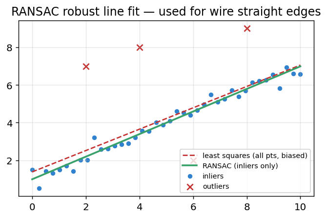

*รูปที่ 2.2 RANSAC [7] ปรับเส้นตรงจากจุดที่สอดคล้อง (inliers) โดยไม่ถูกค่าผิดปกติ (outliers) ดึงเบน
ต่างจากวิธีกำลังสองน้อยสุดที่ใช้ทุกจุด — ใช้กับการปรับขอบตรงของลวดแนวนอน (จัดทำโดยคณะผู้วิจัย)*

## 2.8 การประมวลผลบนอุปกรณ์ขอบ (Edge Computing)

การนำแบบจำลองการเรียนรู้เชิงลึกไปใช้จริงในภาคสนามต้องอาศัยการประมวลผลที่ตัวอุปกรณ์ (edge)
เพื่อลดความหน่วงและการพึ่งพาการเชื่อมต่อเครือข่าย แพลตฟอร์ม **NVIDIA Jetson** [21] เป็นชุด
ประมวลผลขอบที่มี GPU เร่งความเร็วและชุดซอฟต์แวร์ JetPack (CUDA, TensorRT, cuDNN) รองรับ
งานวิทัศน์และการอนุมานเชิงลึกแบบเวลาจริงในสภาพแวดล้อมอุตสาหกรรมที่มีข้อจำกัดด้านพลังงานและ
ความร้อน โครงการเลือก Jetson (สถาปัตยกรรม Ampere, 2048-core GPU) เป็นแกนประมวลผลของต้นแบบ
และส่งออกแบบจำลอง FastSAM เป็นรูปแบบ TensorRT engine เพื่อเร่งความเร็ว (ไฟล์ `FastSAM-s.engine`
ในรีโพซิทอรี)

## 2.9 สรุปงานวิจัยที่เกี่ยวข้องและช่องว่างที่โครงการเติมเต็ม

| กลุ่มงาน | ตัวอย่างอ้างอิง | ผลลัพธ์ | ช่องว่าง |
|---|---|---|---|
| ตรวจจับการกัดกร่อนด้วย DL | [9], [10], [11], [12], [22] | เชิงคุณภาพ (ตำแหน่ง/ระดับ) | ไม่ให้ % การสึกกร่อนเชิงมิติ |
| NDT ลวดสลิง (MFL) | [13], [14], [15] | ตรวจลวดขาด/สูญเสียหน้าตัด | ต้องสัมผัส, ไม่วัดมิติข้อโซ่ |
| แบ่งส่วนภาพ foundation | [3], [4] | มาสก์คุณภาพสูง zero-shot | เป็นเครื่องมือ ไม่ใช่ตัววัด |
| วัดขนาดด้วยภาพ | [16], [17] | แม่นระดับย่อยพิกเซล | ยังไม่ประยุกต์กับโซ่ที่บดบังกันเอง |
| **โครงการนี้** | — | **% การสึกกร่อนเชิงเรขาคณิตจากภาพเดี่ยว** | เชื่อมช่องว่าง DL↔มิติ↔IACS |

**สรุป:** โครงการนี้เชื่อมช่องว่างระหว่างการแบ่งส่วนภาพด้วย foundation model กับการวัดเชิงมิติที่
สอดคล้องกับมาตรฐาน IACS โดยเสนอกระบวนการสร้างแบบจำลองเรขาคณิตของข้อโซ่/ลวดขึ้นใหม่จาก
มาสก์ แล้ววัดการสึกกร่อนจากอัตราส่วนพื้นที่ซ้อนทับ

---

# บทที่ 3 วิธีการดำเนินงานวิจัย

## 3.1 ภาพรวมระบบ

ระบบประกอบด้วยสามส่วนหลัก (1) ชุดยึดจับโซ่และระบบเก็บภาพ (ฮาร์ดแวร์) (2) โมดูลตรวจจับการ
กัดกร่อนด้วย YOLOv8 (แนวทางเสริมเชิงคุณภาพ) และ (3) กระบวนการวัดการสึกกร่อนเชิงเรขาคณิต
8 ขั้นตอน (ผลลัพธ์หลักเชิงปริมาณ) ดังแสดงในรูปที่ 3.1 กระบวนการทั้งหมดพัฒนาด้วยภาษา Python
บนไลบรารี OpenCV, NumPy และ Ultralytics และออกแบบให้ทำงานบน NVIDIA Jetson

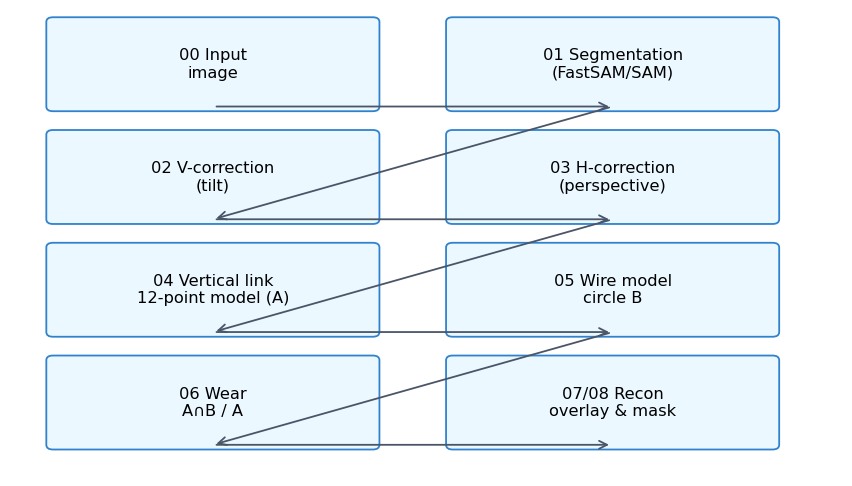

*รูปที่ 3.1 แผนผังกระบวนการวัดการสึกกร่อน 8 ขั้นตอน ตั้งแต่ภาพนำเข้าจนถึงการซ้อนภาพสร้างใหม่
(จัดทำโดยคณะผู้วิจัย)*

## 3.2 ชุดยึดจับโซ่และระบบเก็บภาพ (Hardware)

ได้ออกแบบและสร้างชุดยึดจับโซ่จากอลูมิเนียมโปรไฟล์ โดยใช้โซ่ขนาด 10×25 มม. เป็นตัวอย่างหลัก
สามารถยึดจับและขับเคลื่อนโซ่ทีละข้อเพื่อเข้าสู่กระบวนการตรวจสอบ และรองรับการติดตั้งชุดกล้อง
รับภาพและระบบประมวลผล NVIDIA Jetson (สถาปัตยกรรม Ampere, 2048-core GPU) [21] การเก็บภาพ
ออกแบบให้ทำงานแบบ synchronize capture รองรับการต่อยอดสู่ระบบสเตอริโอวิชัน [8] รูปที่ 3.2 แสดง
ตัวอย่างภาพโซ่ที่เก็บได้ซึ่งใช้เป็นภาพนำเข้าของกระบวนการ

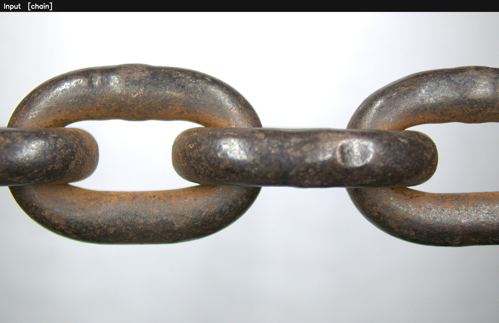

*รูปที่ 3.2 ตัวอย่างภาพโซ่นำเข้า `chain` (สภาพใหม่/อ้างอิง) — ข้อโซ่แนวตั้งถูกลวดแนวนอนสองข้อ
คล้องทับที่ตำแหน่งสัมผัส (interlock) ทั้งสองด้าน*

## 3.3 แนวทางเริ่มต้น: การตรวจจับการกัดกร่อนด้วย Deep Learning (YOLOv8)

> **หมายเหตุ:** แนวทางนี้คือ "แนวทางเริ่มต้น (initial approach)" ของโครงการที่ต่อมาถูก **ลดบทบาท
> ลงเป็นผลงานเสริม** และปรับไปสู่การวัดเชิงเรขาคณิต (หัวข้อ 3.4) รายงานฉบับปิดโครงการนี้ยังคง
> บันทึกรายละเอียดของแนวทางแรกไว้อย่างครบถ้วน เนื่องจากเป็นงานที่ได้ดำเนินการจริง (เก็บข้อมูล เทรน
> โมเดล ทดสอบบนภาพจริง) และเหตุผลของการปรับแนวทาง (pivot) ถือเป็นข้อค้นพบเชิงระเบียบวิธีที่สำคัญ
> ของโครงการ รายละเอียดในหัวข้อนี้อ้างอิงจากรายงานความก้าวหน้ารอบ 6 เดือน (ส่วนที่ 2)

### 3.3.1 การเลือกอัลกอริทึมและสภาพแวดล้อมการฝึก

ในระยะแรกได้เลือกใช้ **YOLOv8** [6] เป็นอัลกอริทึมหลักสำหรับตรวจจับการกัดกร่อน โดยอาศัยแนวคิด
การตรวจจับวัตถุแบบขั้นตอนเดียว (single-stage/one-stage) ของตระกูล YOLO [5] ซึ่งให้ความเร็วสูง
เหมาะกับการทำงานแบบเวลาจริงบนอุปกรณ์ขอบ (NVIDIA Jetson) [21] การฝึกโมเดลดำเนินการบน
**Google Colab** เพื่อใช้ทรัพยากร GPU ในการทดลองหาแบบจำลองที่มีประสิทธิภาพ ก่อนนำไปปรับใช้บน
Jetson จริง จากร่องรอยของการฝึก (มีทั้ง `box_loss`, `seg_loss`, `cls_loss`, `dfl_loss` และผลลัพธ์เป็น
มาสก์ระบายบริเวณกัดกร่อน) โมเดลที่ใช้เป็นชนิด **instance segmentation (YOLOv8-seg)** ซึ่งให้ทั้ง
กรอบขอบเขตและมาสก์ระดับพิกเซลของบริเวณกัดกร่อน

### 3.3.2 ชุดข้อมูลและปัญหา domain gap ที่ต้นทาง

ชุดข้อมูลที่ใช้คือชุด **"Corrosion" จาก Roboflow** จำนวน **118 ภาพ** ประเด็นสำคัญที่พบคือ ภาพ
ในชุดข้อมูลส่วนใหญ่เป็น **ภาพสังเคราะห์ที่สร้างด้วย generative AI** (สังเกตจากชื่อไฟล์รูปแบบ
`Firefly-Inpaint-*`, `Firefly-one-realistic-simple-*` ซึ่งบ่งชี้ว่าใช้เครื่องมือ inpainting ของ Adobe Firefly)
โดยเป็นภาพการกัดกร่อนบน **ชิ้นส่วนกลไก** เช่น เฟือง แบริ่ง จานโลหะ ไม่ใช่ภาพข้อโซ่สมอจริง
ข้อเท็จจริงนี้อธิบายสาเหตุของ **domain gap** ได้ชัดเจนตั้งแต่ต้นทาง กล่าวคือ ลักษณะพื้นผิว รูปทรง แสง
และบริบทของภาพฝึก (ชิ้นส่วนกลไกสังเคราะห์) แตกต่างจากภาพเป้าหมาย (โซ่สมอจริงที่ผิวหยาบ มีน้ำ/
คราบ และมุมมองเฉพาะ) ปัญหาคุณภาพและความเป็นตัวแทนของชุดข้อมูลฝึกนี้สอดคล้องกับข้อสังเกตใน
วรรณกรรมว่าคุณภาพชุดข้อมูลมีผลอย่างมากต่อสมรรถนะของการตรวจจับการกัดกร่อน [10], [12]

### 3.3.3 ผลการฝึกโมเดล

ทำการฝึกจำนวน **150 epochs** ผลการฝึกสรุปได้ดังตารางที่ 3.1 และรูปที่ 3.3

**ตารางที่ 3.1** ผลการฝึกโมเดล YOLOv8-seg ตรวจจับการกัดกร่อน (จากรายงานความก้าวหน้ารอบ 6 เดือน)

| Model | Precision | Recall | mAP@50 |
|---|---|---|---|
| Corrosion YOLOv8 | 70.7% | 58.7% | 63.9% |

พฤติกรรมการลู่เข้าของการฝึก (รูปที่ 3.3):
- **ค่าความสูญเสียฝั่งฝึก (train losses)** ลดลงและลู่เข้าอย่างมีเสถียรภาพทุกตัว โดย `train/box_loss`
  ลดลงจาก **1.8 → ต่ำกว่า 0.6** แสดงว่าโมเดลเรียนรู้การระบุตำแหน่งวัตถุได้ดี ส่วน `seg_loss`,
  `cls_loss`, `dfl_loss` ลดลงในทำนองเดียวกัน
- **ค่าความสูญเสียฝั่ง validation** `val/box_loss` ลดลงจาก **3.5 → ต่ำกว่า 1.5** (มีจุดพุ่งสูงช่วงต้น
  แล้วลดลงเข้าสู่ระดับต่ำ) เป็นสัญญาณของการเรียนรู้ที่มีเสถียรภาพ
- **เมตริกสมรรถนะ** `precision`, `recall`, `mAP@50`, `mAP@50-95` ไต่ขึ้นและอิ่มตัวที่ค่าปลายทาง
  P = 70.7%, R = 58.7%, mAP@50 = 63.9% ตามลำดับ

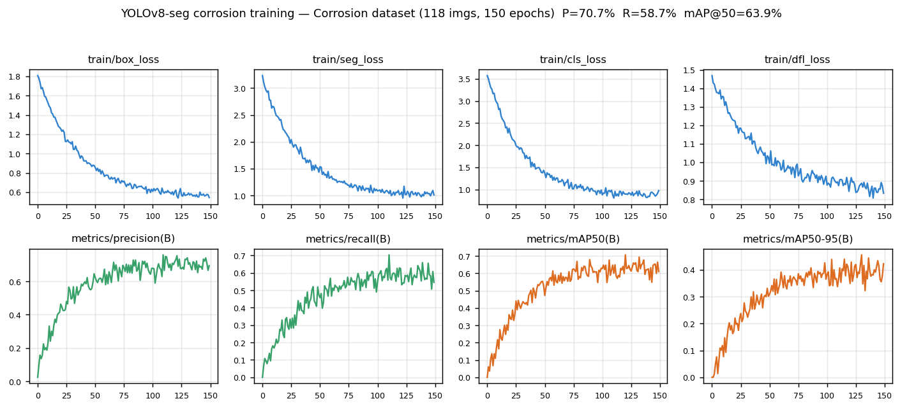

*รูปที่ 3.3 แผงเส้นโค้งการฝึก YOLOv8-seg บนชุดข้อมูล Corrosion — ค่าความสูญเสีย (box/seg/cls/dfl)
ลดลงลู่เข้า และเมตริก precision/recall/mAP ไต่ขึ้นสู่ค่าปลายทาง (สร้างขึ้นใหม่จากค่าที่บันทึกในการฝึกจริง
ให้ตรงกับรูปที่ 2.3 ของรายงานความก้าวหน้ารอบ 6 เดือน; จัดทำโดยคณะผู้วิจัย)*

### 3.3.4 ผลการทดสอบเชิงคุณภาพบนภาพโซ่จริง

เมื่อนำโมเดลที่ฝึกแล้วไปทดสอบ (inference) กับ **ภาพข้อโซ่จริงที่มีสนิม** โมเดลสามารถระบุและระบาย
มาสก์บริเวณกัดกร่อนได้ (มาสก์สีเขียวทับบริเวณสนิม) พร้อมค่าความมั่นใจ (confidence) ในช่วงประมาณ
**0.5–0.6** ต่อกล่องตรวจจับ (อ้างอิงรูปที่ 2.5 ของรายงานความก้าวหน้ารอบ 6 เดือน: ภาพนำเข้า →
มาสก์แบ่งส่วน → กล่องพร้อมค่าความมั่นใจ) ผลนี้ยืนยันว่าโมเดล **ตรวจจับได้จริงเชิงคุณภาพ** แต่ค่าความ
มั่นใจระดับปานกลางและ Recall 58.7% สะท้อน domain gap ที่วิเคราะห์ไว้ในหัวข้อ 3.3.2

### 3.3.5 ข้อจำกัดของแนวทางเชิงคุณภาพ

**ข้อจำกัดที่พบ ซึ่งนำไปสู่การปรับแนวทาง (หัวข้อ 3.4):**
- **ให้ผลเชิงคุณภาพ ไม่ใช่เชิงมิติ** — ผลลัพธ์เป็นการระบุตำแหน่ง/มาสก์บริเวณกัดกร่อน (มี/ไม่มี) ไม่ได้ให้
  **ปริมาณการสึกกร่อนเป็นเปอร์เซ็นต์** ที่นำไปเทียบกับเกณฑ์ IACS 12% ได้โดยตรง สอดคล้องกับ
  ข้อสังเกตในบทปริทัศน์ว่างานตรวจจับการกัดกร่อนด้วย DL ส่วนใหญ่ให้ผลเชิงคุณภาพ [9], [12]
- **domain gap จากชุดข้อมูลสังเคราะห์** — ชุดข้อมูล Corrosion เป็นภาพสังเคราะห์ของชิ้นส่วนกลไก
  ไม่ตรงกับลักษณะพื้นผิว/แสง/มุมมองของโซ่สมอจริง ทำให้ค่า Recall ค่อนข้างต่ำ (58.7%) [10]
- **สนิมผิว ≠ การสึกเชิงมิติ** — "สนิม/การกัดกร่อนที่ผิว" (surface corrosion) กับ "การสึกหรอที่ทำให้ขนาด
  ลดลง (dimensional wear)" เป็นคนละปรากฏการณ์ทางวิศวกรรม เกณฑ์ความปลอดภัยของ IACS อ้างอิงกับ
  *ขนาดที่หายไป* ไม่ใช่พื้นที่สนิม [1], [2] ดังนั้นแม้ตรวจจับสนิมได้แม่นยำก็ยังไม่ตอบโจทย์ go/no-go ตาม
  มาตรฐาน

## 3.4 การปรับแนวทางสู่การวิเคราะห์เชิงกายภาพ (Pivot to Physical-based Analysis)

จากข้อจำกัดข้างต้น คณะผู้วิจัยตัดสินใจปรับจุดเน้นของผลลัพธ์หลักของโครงการไปสู่
**การวัดการสึกกร่อนเชิงเรขาคณิต/กายภาพ (physical, geometry-based wear measurement)** เนื่องจาก

1. **สอดคล้องกับมาตรฐานโดยตรง** — ให้ค่าการสึกกร่อนเป็นเปอร์เซ็นต์ ที่เทียบกับเกณฑ์ IACS
   (≤ 12%) และแนวคิด $\bar D \ge 0.88 D_0$ ได้ทันที [1], [2]
2. **เชิงปริมาณและทวนสอบได้** — วัดจากรูปทรงจริงของข้อโซ่ ให้ผลซ้ำได้ (repeatable) และตรวจสอบ
   ย้อนกลับกับเวอร์เนียร์คาลิปเปอร์ได้ [16], [17]
3. **ไม่พึ่งชุดข้อมูล annotation ขนาดใหญ่** — ใช้การแบ่งส่วน (segmentation) ด้วย foundation model
   [3], [4] ร่วมกับแบบจำลองเชิงเรขาคณิต จึงหลีกเลี่ยงปัญหา domain gap ของชุดข้อมูลสนิม

การตรวจจับการกัดกร่อนด้วย YOLOv8 (หัวข้อ 3.3) จึงถูกจัดเป็น **ผลงานเสริม/องค์ประกอบเชิงคุณภาพ**
ในขณะที่ระเบียบวิธีในหัวข้อ 3.5 เป็นผลลัพธ์หลักเชิงปริมาณของโครงการ

## 3.5 ระเบียบวิธีวัดการสึกกร่อนเชิงเรขาคณิต (Geometry-based Wear Pipeline)

**หลักการ:** ที่ข้อต่อของโซ่ (interlock) หน้าตัดของ **ลวดแนวนอน (horizontal wire)** จะกดสัมผัสเข้าไปใน
**ข้อโซ่แนวตั้ง (vertical link)** เมื่อเกิดการสึกกร่อน เนื้อโลหะบริเวณผิวสัมผัสจะหายไป ทำให้พื้นที่
ซ้อนทับของสองชิ้นส่วนเปลี่ยนไป ระบบจึงนิยามการสึกกร่อนจาก **อัตราส่วนพื้นที่ซ้อนทับ** (รูปที่ 3.4)

$$ \text{Wear} = \frac{\text{area}(A \cap B)}{\text{area}(A)} \times 100\% $$

เมื่อ $A$ คือพื้นที่เสี้ยว (crescent) ปลายข้อโซ่แนวตั้งที่สร้างขึ้นใหม่ และ $B$ คือวงกลมปลายลวดแนวนอน
(Ø = ความหนาลวด $b$)

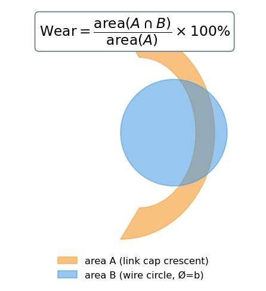

*รูปที่ 3.4 นิยามเชิงเรขาคณิตของการสึกกร่อน: พื้นที่เสี้ยว A ของปลายข้อโซ่แนวตั้ง ซ้อนทับกับวงกลม B
ของปลายลวดแนวนอน อัตราส่วน $A\cap B / A$ คือค่าการสึกกร่อน (จัดทำโดยคณะผู้วิจัย)*

กระบวนการประกอบด้วย 8 ขั้นตอน (แต่ละขั้นบันทึกภาพประกอบรายงานไว้ใน `debug_v2/`) ดังแผนภาพลำดับงาน
ในรูปที่ 3.4ก แต่ละกล่องแสดงชื่อกระบวนการ ผลลัพธ์ โฟลเดอร์ภาพประกอบ และเลขอ้างอิงทฤษฎีที่เกี่ยวข้อง

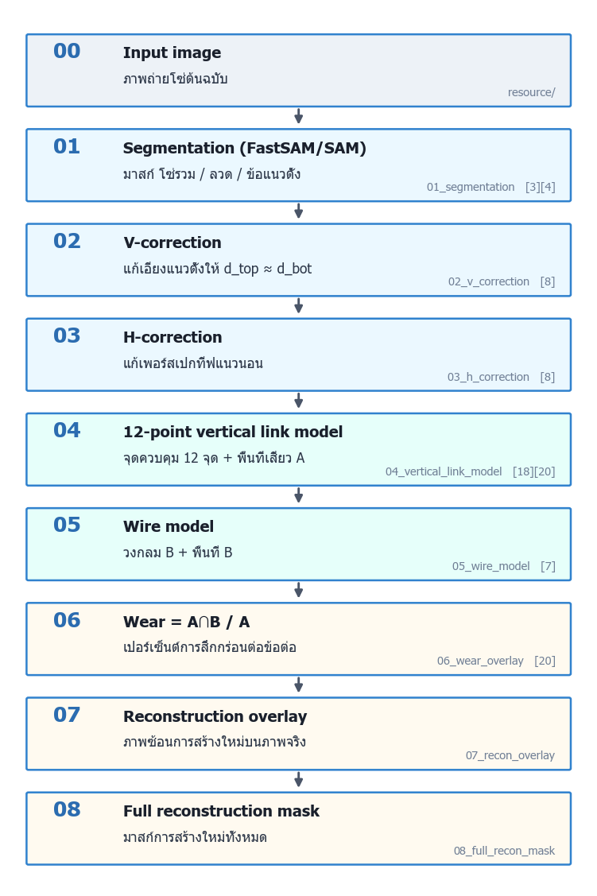

*รูปที่ 3.4ก แผนภาพลำดับงาน (flowchart) 8 ขั้นตอนของกระบวนการวัดการสึกกร่อน ตั้งแต่ภาพต้นฉบับจนถึง
มาสก์การสร้างใหม่ทั้งหมด (จัดทำโดยคณะผู้วิจัย)*

### 3.5.1 ขั้นที่ 1 — การแบ่งส่วนภาพ (Segmentation)

ขั้นตอนนี้แบ่งภาพโซ่ออกเป็นสามมาสก์ ได้แก่ มาสก์โซ่รวม (full), มาสก์ลวดแนวนอน (wire) และ
มาสก์ข้อโซ่แนวตั้ง (vertical) โดยไม่ใช้แบบจำลองเดียวทำทั้งหมด แต่แบ่งเป็นสามขั้นย่อยที่เสริมจุดแข็ง
ของกันและกัน คือ การประมวลผลภาพแบบดั้งเดิมสำหรับหาเนื้อเหล็กทั้งหมด และแบบจำลองพื้นฐาน (foundation
model) แบบ **point-guided** สำหรับแยกลวดแนวนอน วิธีนี้ไม่ต้องฝึกแบบจำลองเฉพาะงานจึงหลีกเลี่ยงปัญหา
domain gap ของชุดข้อมูลสนิมที่กล่าวในหัวข้อ 3.3

**(ก) มาสก์โซ่รวม (full) — การประมวลผลภาพเชิงคลาสสิก (Wiener + Otsu).** มาสก์นี้ครอบคลุมเนื้อเหล็ก
ทั้งเส้นของโซ่ (ทั้งข้อแนวตั้งและลวดแนวนอนรวมกัน) ทำหน้าที่สองอย่างพร้อมกัน คือ (1) เป็นขอบเขตเนื้อเหล็ก
สำหรับนำไปลบลวดออกในขั้นย่อย (ค) และ (2) ให้ข้อมูลเรขาคณิตของ "รู" ระหว่างข้อโซ่เพื่อใช้คำนวณจุดนำ
(prompt points) ในขั้นย่อย (ข) เนื่องจากงานทั้งสองต้องการความเสถียรและความเร็วสูงเพื่อรองรับการทำงาน
แบบเวลาจริง ขั้นนี้จึงเลือกใช้การประมวลผลภาพเชิงคลาสสิกล้วน ไม่พึ่งโครงข่ายประสาท ประกอบด้วยห้าขั้นตอน
ย่อยดังนี้

**1) การกรองลดสัญญาณรบกวนแบบ Wiener.** แปลงภาพเป็นระดับเทาแล้วกรองด้วยตัวกรอง Wiener แบบปรับ
ตัวได้ (adaptive) โดยใช้หน้าต่างเลื่อน (sliding window) ขนาด 5×5 พิกเซล [18] ตัวกรองประมาณค่าพิกเซล
ที่แท้จริงจากสถิติเฉพาะถิ่นในหน้าต่างตามสมการ

$$\hat f(x,y) = \mu + \frac{\sigma^2 - \nu^2}{\sigma^2}\,\big(g(x,y) - \mu\big)$$

โดย $\mu$ และ $\sigma^2$ คือค่าเฉลี่ยและความแปรปรวนของความเข้มในหน้าต่างรอบพิกเซล $(x,y)$ ส่วน $\nu^2$
คือความแปรปรวนของสัญญาณรบกวน (ประมาณจากค่าเฉลี่ยของความแปรปรวนเฉพาะถิ่นทั้งภาพ) ข้อดีของ
Wiener เหนือการเบลอแบบเกาส์เซียนคือ **ในบริเวณเรียบ** ($\sigma^2 \approx \nu^2$) ตัวกรองจะลดสัญญาณ
รบกวนได้มาก แต่ **ในบริเวณที่เป็นขอบ** ($\sigma^2 \gg \nu^2$) ตัวประกอบ $(\sigma^2-\nu^2)/\sigma^2 \to 1$
ทำให้ค่าพิกเซลเกือบไม่เปลี่ยน จึงรักษาขอบของโซ่ไว้คมชัด ซึ่งสำคัญต่อความแม่นยำของการกำหนดขีดแบ่ง
ในขั้นถัดไป

**2) การกำหนดขีดแบ่งแบบ Otsu (แยกเนื้อเหล็กออกจากพื้นหลัง).** แปลงภาพที่กรองแล้วเป็นภาพไบนารีด้วย
วิธีของ Otsu [19] ซึ่งเลือกขีดแบ่ง $t^{*}$ ที่ทำให้ความแปรปรวนระหว่างคลาส (between-class variance) สูงสุด

$$t^{*} = \arg\max_{t}\ \sigma_B^2(t),\qquad \sigma_B^2(t) = \omega_0(t)\,\omega_1(t)\,\big[\mu_0(t) - \mu_1(t)\big]^2$$

โดย $\omega_0,\omega_1$ คือสัดส่วนพิกเซลของสองคลาส (พื้นหลัง/วัตถุ) ที่ขีดแบ่ง $t$ และ $\mu_0,\mu_1$ คือ
ค่าเฉลี่ยความเข้มของแต่ละคลาส วิธีนี้เลือกขีดแบ่งโดยอัตโนมัติจากฮิสโทแกรมของภาพ จึงปรับตัวเข้ากับ
สภาพแสงที่ต่างกันในแต่ละภาพโดยไม่ต้องตั้งค่าด้วยมือ ในระบบนี้ใช้โหมด `THRESH_BINARY_INV` ร่วมกับ
Otsu เพื่อให้ **เนื้อเหล็กของโซ่ (ซึ่งเข้มกว่าพื้นหลัง) กลายเป็นสีขาว (255)** และพื้นหลังเป็นสีดำ (0)

**3) การเปิดทางสัณฐานวิทยา (morphological opening) เพื่อกำจัดจุดรบกวน.** ทำการเปิด (opening) ภาพ
ไบนารีด้วยธาตุโครงสร้าง (structuring element) รูปวงรีขนาด 3×3 พิกเซล จำนวน 1 รอบ [18] การเปิดคือ
การกร่อน (erosion) ตามด้วยการขยาย (dilation) $A \circ B = (A \ominus B) \oplus B$ ซึ่งกำจัดจุดขาวเล็ก ๆ ที่
กระจัดกระจาย (speckle) ที่มีขนาดเล็กกว่าธาตุโครงสร้าง โดยไม่ทำให้รูปทรงหลักของโซ่ผิดเพี้ยน

**4) การถมรูจากสนิมและแสงสะท้อน (hole filling แบบมีเงื่อนไขพื้นที่).** ปัญหาสำคัญของภาพโซ่จริงคือ
สนิม รอยกัดกร่อน และแสงสะท้อนบนผิวโลหะ ทำให้ภายในเนื้อเหล็กมีจุดที่ความเข้มต่างจากบริเวณรอบข้าง
มาก Otsu จึงจัดจุดเหล่านั้นเป็น "พื้นหลัง" เกิดเป็น **รูปลอม (false holes)** กลางเนื้อโซ่ ระบบแก้ปัญหานี้ด้วย
การหาเส้นขอบทั้งหมดแบบมีลำดับชั้น (`RETR_CCOMP`) ด้วยอัลกอริทึมของ Suzuki–Abe [20] ซึ่งจำแนกเส้นขอบ
ออกเป็นสองระดับ คือ **ขอบนอก (outer boundary)** และ **รูภายใน (hole)** โดยเส้นขอบที่มี "แม่" (parent)
ในลำดับชั้นคือรูภายใน จากนั้น**ถมรูภายในที่มีพื้นที่เล็กกว่า 10,000 พิกเซลให้เป็นสีขาว** ค่าขีดแบ่งพื้นที่
10,000 พิกเซลนี้เป็นตัวแปรปรับสำคัญที่ทำหน้าที่ **แยกรูปลอมออกจากรูจริง** กล่าวคือ รูที่เกิดจากสนิม/แสง
สะท้อนมักมีขนาดเล็ก (< 10,000 พิกเซล) จึงถูกถมกลับเป็นเนื้อเหล็กตัน ในขณะที่ **รูจริงของข้อโซ่** (ช่องที่ข้อ
โซ่คล้องกัน ซึ่งมีขนาดใหญ่กว่ามาก) จะไม่ถูกถมและยังคงเปิดไว้ — ซึ่งจำเป็น เพราะรูจริงเหล่านี้คือข้อมูล
เรขาคณิตที่ขั้นย่อย (ข) นำไปคำนวณตำแหน่งจุดนำของลวดแนวนอน

**5) การเลือกก้อนต่อเนื่องที่ใหญ่ที่สุด (largest connected component).** ติดป้ายองค์ประกอบเชื่อมต่อ
(connected-component labelling) [18] ให้ทุกก้อนขาวในภาพ แล้วนับจำนวนพิกเซลของแต่ละก้อน และ**เก็บ
เฉพาะก้อนที่ใหญ่ที่สุด** เป็นเนื้อโซ่ทั้งเส้น ขั้นตอนนี้ตัดเศษวัตถุพื้นหลัง เศษฝุ่น หรือวัตถุอื่นที่หลุดรอด
การกรองมาก่อนหน้าออกไป เหลือไว้เพียงตัวโซ่หลักที่ต้องการตรวจสอบ

ผลลัพธ์ของขั้นย่อย (ก) คือมาสก์ไบนารีของเนื้อเหล็กโซ่ทั้งเส้น ทั้งกระบวนการเป็นการดำเนินการบนภาพล้วน
(ไม่มีการอนุมานด้วยโครงข่ายประสาท) จึงทำงานได้ในระดับมิลลิวินาที ให้ผลแบบกำหนดได้แน่นอน (deterministic)
และไม่มีปัญหา domain gap เหมาะสมกับการเป็นส่วนหน้า (front-end) ที่เร็วและเสถียรของกระบวนการเวลาจริง

**(ข) มาสก์ลวดแนวนอน (wire) — FastSAM แบบ point-guided prompt.** ใช้แบบจำลองพื้นฐาน **FastSAM** [4]
(เช็คพอยต์ `FastSAM-s.pt`) ซึ่งใช้สถาปัตยกรรม CNN (YOLOv8-seg) จึงเร็วพอสำหรับการทำงานแบบเวลาจริงบน
อุปกรณ์ขอบ ต่างจาก SAM เดิม [3] ที่ใช้ Vision Transformer ขนาดใหญ่และช้าเกินไป โดย**ไม่ใช้โหมด segment-
everything** เพราะจะทำให้แบบจำลองจับโซ่ทั้งเส้นเป็นก้อนเดียว แต่ป้อน**จุดนำ (prompt points)** ที่คำนวณ
อัตโนมัติจากเรขาคณิตของมาสก์โซ่รวม ให้ชี้เฉพาะลวดแนวนอนแต่ละเส้น ขั้นตอนการหาจุดนำเป็นดังนี้

1. **หารู (holes) และจุดศูนย์ถ่วง.** หาเส้นขอบแบบมีลำดับชั้น (`RETR_CCOMP`) [20] ในมาสก์โซ่รวมแล้ว
   เลือกเฉพาะรูภายใน (contour ที่มี parent) ที่มีพื้นที่ใหญ่กว่า 1,000 พิกเซล เพื่อกรองรูจิ๋วที่เป็นสัญญาณ
   รบกวนทิ้ง จากนั้นคำนวณจุดศูนย์ถ่วง (centroid) ของแต่ละรูจากโมเมนต์ของภาพ
   $(c_x, c_y) = (m_{10}/m_{00},\ m_{01}/m_{00})$ แล้ว**เรียงลำดับรูจากซ้ายไปขวาตามค่า $c_x$** — รูแต่ละรู
   คือช่องว่างที่ข้อโซ่สองข้อคล้องกัน ดังนั้นตำแหน่งของรูจึงสะท้อนโครงสร้างการเรียงตัวของโซ่ทั้งเส้น
2. **คำนวณจุดนำหลักจากกึ่งกลางระหว่างรู.** เนื่องจากลวดแนวนอนที่คล้องผ่านจะพาดอยู่ระหว่างรูสองรู
   ที่ติดกันพอดี จุดกึ่งกลางระหว่างรู $i$ และ $i{+}1$ จึงตกบนเนื้อลวดแนวนอนเสมอ

   $$\big(m_x, m_y\big) = \left(\tfrac{c_{x,i} + c_{x,i+1}}{2},\ \tfrac{c_{y,i} + c_{y,i+1}}{2}\right)$$

   ใช้จุดเหล่านี้เป็นจุดนำหลัก แล้ว**เพิ่มจุดคาดการณ์ (extrapolation)** ที่ขอบซ้ายสุดและขวาสุด โดยเลื่อน
   ออกจากรูแรกและรูสุดท้ายเป็นระยะเท่ากับ **ระยะห่างเฉลี่ยระหว่างรู** $\bar d = \operatorname{mean}(c_{x,i+1}-c_{x,i})$
   ได้จุด $(c_{x,0}-\bar d,\ c_{y,0})$ และ $(c_{x,n-1}+\bar d,\ c_{y,n-1})$ เพื่อครอบคลุมลวดแนวนอนที่ขอบภาพ
   ซึ่งไม่มีรูขนาบทั้งสองข้าง กรณีพิเศษ: ถ้าพบ**รูเดียว** (ภาพซูมใกล้) จะวางจุดนำขนาบซ้าย–ขวาของรูนั้น
   ที่ระยะ ±300 พิกเซล และถ้า**ไม่พบรูเลย** จะถอยไปใช้จุดกึ่งกลางภาพเป็นค่าเริ่มต้น (fallback)
3. **คัดกรองจุดนำให้อยู่บนเนื้อเหล็กจริง.** ตรึงพิกัดจุดนำให้อยู่ในกรอบภาพ แล้วเก็บเฉพาะจุดที่ตกบนเนื้อ
   เหล็ก (มาสก์โซ่รวม = 255) เท่านั้น เพื่อป้องกันจุดที่คำนวณแล้วหลุดออกไปนอกตัวโซ่ (เช่น เมื่อโซ่โค้ง
   หรือรูเรียงไม่เป็นเส้นตรง) ไม่ให้ป้อนจุดที่เป็นพื้นหลังให้แบบจำลอง
4. **อนุมานทีละจุดแล้วรวมมาสก์.** รัน FastSAM ทีละจุด โดยกำหนด label = 1 (foreground) ให้ทุกจุด
   แบบจำลองจะคืนมาสก์ผู้สมัคร (candidate masks) พร้อมค่าความเชื่อมั่น ระบบ**เลือกมาสก์ที่มีความเชื่อมั่น
   สูงสุด** ($\arg\max$ ของ confidence) ของแต่ละจุด ปรับขนาดกลับเท่าภาพต้นฉบับ แล้ว**รวมทุกมาสก์เข้าด้วยกัน
   ด้วยการ OR ระดับบิต (bitwise-OR)** เป็นมาสก์ลวดแนวนอนสุดท้าย การอนุมานทีละจุดนี้เป็นหัวใจสำคัญ
   เพราะหากป้อนหลายจุดพร้อมกันในการเรียกครั้งเดียว แบบจำลองมีแนวโน้มจะรวมลวดทุกเส้น (และเนื้อโซ่
   ที่เชื่อมต่อกัน) เป็นวัตถุก้อนเดียว ทำให้มาสก์ลามไปติดข้อแนวตั้งและใช้แยกลวดไม่ได้

เนื่องจากตำแหน่งจุดนำทั้งหมดในขั้นย่อยนี้คำนวณจากเรขาคณิตของรูในมาสก์โซ่รวม (ก) ขั้นย่อย (ก) และ (ข)
จึงทำงานประสานกัน โดย (ก) ที่เป็นการประมวลผลภาพเร็วทำหน้าที่ "ชี้เป้า" ให้แบบจำลอง (ข) ทำงานเฉพาะจุด
ที่จำเป็น แทนการให้แบบจำลองค้นทั้งภาพเอง ซึ่งช่วยทั้งด้านความเร็วและความแม่นยำของการแยกลวด

**(ค) มาสก์ข้อโซ่แนวตั้ง (vertical) — การลบเชิงเซตแบบรับรู้โทโพโลยี.** เมื่อได้มาสก์เนื้อเหล็กทั้งเส้น (ก)
และมาสก์ลวดแนวนอน (ข) แล้ว ข้อโซ่แนวตั้งคือส่วนที่เหลือจากการนำสองมาสก์มาลบกัน ขั้นตอนมีดังนี้

1. **ขยายขอบลวดก่อนลบ (dilation).** ขยายมาสก์ลวดแนวนอนด้วยธาตุโครงสร้างรูปวงรีขนาด 10×10 พิกเซล
   จำนวน 2 รอบ ก่อนนำไปลบ เหตุผลคือขอบรอยต่อระหว่างลวดกับข้อแนวตั้งมักมีพิกเซลก้ำกึ่ง (anti-aliasing)
   และความคลาดเคลื่อนเล็กน้อยของมาสก์จากแบบจำลอง หากลบด้วยขอบพอดี ๆ จะมีเนื้อลวดบางส่วนหลง
   เหลือติดกับข้อแนวตั้งและรบกวนการหาจุดควบคุมในขั้นที่ 4 การขยายขอบเผื่อไว้จึงรับประกันว่าเนื้อลวด
   ถูกกำจัดออกจนหมด
2. **ลบเชิงเซต.** คำนวณมาสก์ข้อแนวตั้งดิบจากการดำเนินการเซต
   $\text{vert} = \text{full} \,\wedge\, \neg\,\text{dilate}(\text{wire})$
   (bitwise-AND ระหว่างมาสก์โซ่รวมกับส่วนกลับของมาสก์ลวดที่ขยายขอบแล้ว) เหลือไว้เฉพาะเนื้อเหล็กที่
   ไม่ใช่ลวดแนวนอน
3. **กรองก้อนด้วยขนาด และเก็บทุกข้อ.** ติดป้ายองค์ประกอบเชื่อมต่อ [18] ให้ผลลัพธ์ แล้ว**เก็บทุกก้อนที่มี
   พื้นที่ใหญ่กว่า 2,000 พิกเซล** จุดสำคัญคือ *ไม่ได้เก็บเพียงก้อนเดียว* เหมือนขั้นย่อย (ก) แต่เก็บทุกก้อนที่ผ่าน
   เกณฑ์ เพราะในหนึ่งภาพอาจมีข้อโซ่แนวตั้งหลายข้อเรียงกัน (หลายข้อต่อ/interlock) ที่ต้องวัดทั้งหมด ส่วน
   เกณฑ์ 2,000 พิกเซลใช้ตัดเศษฝุ่นหรือชิ้นส่วนเล็ก ๆ ที่หลงเหลือจากการลบทิ้ง

เนื่องจากในมุมมองจากด้านบน (top-down) ปลายข้อแนวตั้งทั้งสองด้านถูกลวดแนวนอนที่คล้องผ่าน**บดบัง**
มาสก์ข้อแนวตั้งที่ได้จึงเหลือเพียง **แถบราง (rail) บนและล่าง** ของข้อ โดยไม่มีปลายโค้ง (cap) ทั้งสองข้าง
ข้อจำกัดเชิงกายภาพนี้เองคือเหตุผลที่กระบวนการต้อง **สร้างปลายข้อที่ถูกบดบังขึ้นใหม่** ด้วยแบบจำลองจุด
ควบคุม 12 จุดในขั้นที่ 4 (หัวข้อ 3.5.4) เพื่อให้ได้พื้นที่เสี้ยว A ที่สมบูรณ์สำหรับคำนวณการสึกกร่อน

รูปที่ 3.5 แสดงมาสก์การแบ่งส่วนสามชั้นที่ได้จากสามขั้นย่อยข้างต้น

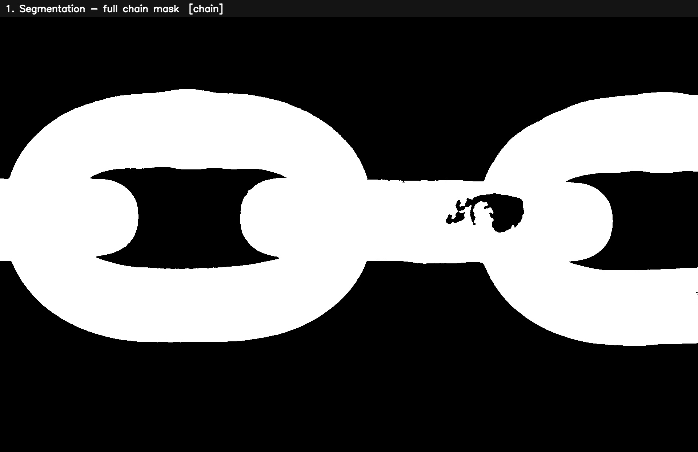

*รูปที่ 3.5(ก) มาสก์โซ่รวม (full) ของตัวอย่าง `chain`*

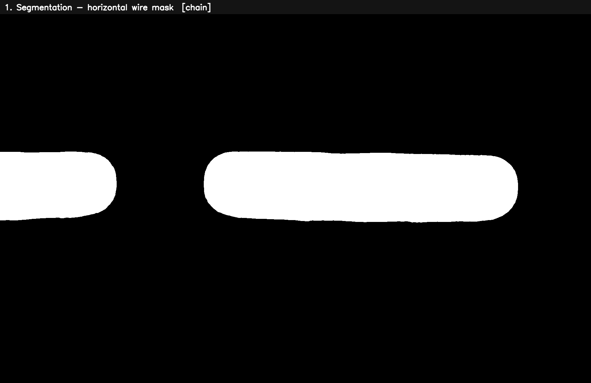

*รูปที่ 3.5(ข) มาสก์ลวดแนวนอน (wire) — ใช้สร้างวงกลม B*

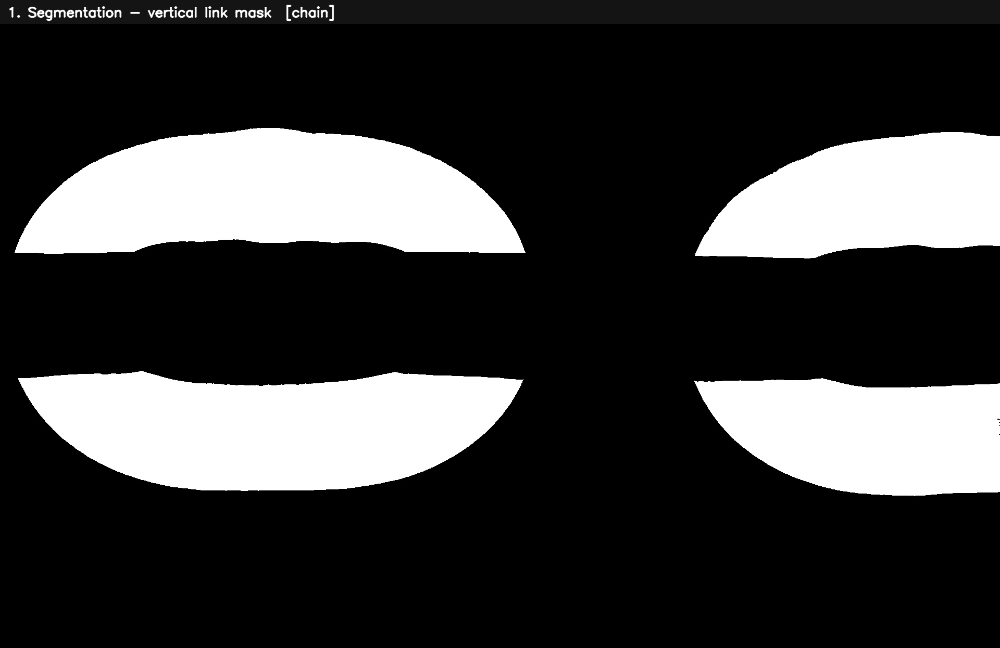

*รูปที่ 3.5(ค) มาสก์ข้อโซ่แนวตั้ง (vertical) — ใช้สร้างพื้นที่ A; สังเกตว่าปลายข้อทั้งสองถูกลวดบดบัง
เหลือเพียงแถบราง (rail) บนและล่าง*

### 3.5.2 ขั้นที่ 2–3 — การแก้เพอร์สเปกทีฟ (V/H correction)

เนื่องจากภาพถ่ายจากกล้องเดี่ยวเป็นการฉายแบบเพอร์สเปกทีฟ (perspective projection) [8] เมื่อระนาบ
เซนเซอร์ของกล้องไม่ตั้งฉากกับระนาบของโซ่ ข้อโซ่จะปรากฏ **เอียงในแนวตั้ง** (ความหนายอดข้อบน–ล่าง
ไม่เท่ากัน) และ **ลวดแนวนอนกว้างไม่สม่ำเสมอ** (ด้านใกล้กล้องกว้างกว่าด้านไกล) ความผิดเพี้ยนนี้จะทำให้
เปอร์สเปกทีฟถูกแปลไปเป็นการสึกกร่อนเทียม (apparent wear) หากไม่แก้ไข เนื่องจากแบบจำลองเรขาคณิต
ในขั้นถัดไปตั้งอยู่บนสมมติฐานว่าแกนปลายข้ออยู่ในแนวนอนและลวดมีความกว้างคงที่ เราจึงแก้ความผิดเพี้ยน
สองแกนแยกกันเป็นสองขั้น โดยอาศัย **ข้อจำกัดเชิงสมมาตร (symmetry constraint)** ของโซ่กลมที่ยัง
ไม่สึก แทนการปรับเทียบกล้อง (camera calibration) แบบเต็มรูปแบบ ซึ่งไม่จำเป็นและไม่สะดวกในสายการผลิต

**(ก) V-correction — แก้การเอียงแนวตั้งด้วยข้อจำกัดสมมาตรของข้อโซ่**

ข้อโซ่กลมที่ยังไม่สึกมีสมมาตรบน–ล่าง กล่าวคือความหนาเนื้อเหล็กที่ยอดข้อด้านบน ($d_{top}$) ต้องเท่ากับ
ที่ยอดข้อด้านล่าง ($d_{bot}$) หากวัดได้ $d_{top}\neq d_{bot}$ จึงเป็นสัญญาณของการเอียงกล้องรอบแกนนอน
เราวัด $d_{top},d_{bot}$ ที่คอลัมน์ยอดข้อ (apex) โดยสแกนขอบบน–ล่างของก้อนข้อโซ่บนและล่าง แล้วกำหนด
ความหนาเป้าหมายเป็นค่าเฉลี่ย และหาแกนสมมาตร $y_{sym}$ จากจุดกึ่งกลางระหว่างขอบในของสองก้อน

$$ d_{target} = \frac{d_{top} + d_{bot}}{2}, \qquad y_{sym} = \frac{y_{top,inner} + y_{bot,inner}}{2} $$

มุมเอียงกล้องประมาณได้จากอัตราส่วนความหนา (แบบจำลอง foreshortening อย่างง่าย)

$$ \theta = \arccos\!\left(\min\left(1,\ \frac{d_{bot}}{d_{top}}\right)\right) $$

จากนั้นกำหนดตัวคูณมาตราส่วนคนละค่าสำหรับครึ่งบนและครึ่งล่าง เพื่อยืด/บีบให้ความหนาทั้งสองเท่ากับเป้าหมาย

$$ s_{top} = \frac{d_{target}}{d_{top}}\ (\leq 1,\ \text{บีบ}), \qquad s_{bot} = \frac{d_{target}}{d_{bot}}\ (\geq 1,\ \text{ยืด}) $$

การแปลงภาพทำแบบ **inverse mapping** ผ่าน `cv2.remap` โดยไม่แตะแกน $x$ (แก้เฉพาะแนวตั้ง) สำหรับทุก
พิกเซลปลายทาง $(x,y)$ พิกัดต้นทางคือ

$$ x_{src} = x, \qquad y_{src} = y_{sym} + \frac{y - y_{sym}}{s},\quad s = \begin{cases} s_{top}, & y \leq y_{sym}\\ s_{bot}, & y > y_{sym} \end{cases} $$

โดยภาพสี interpolate แบบ `INTER_LINEAR` และมาสก์แบบ `INTER_NEAREST` เพื่อคงค่าไบนารี ผลลัพธ์ทำให้
$d_{top} = d_{bot} = d_{target}$ (รูปที่ 3.6ก)

**(ข) H-correction — แก้เพอร์สเปกทีฟแนวนอนด้วยโฮโมกราฟี**

เมื่อกล้องมองโซ่จากด้านข้าง (เช่นเยื้องไปทางขวา) ลวดแนวนอนจะปรากฏเป็น **รูปสี่เหลี่ยมคางหมู
(trapezoid)** แทนสี่เหลี่ยมผืนผ้า — ด้านใกล้กล้องกว้างกว่าด้านไกล เราเลือกช่วงลวดแนวนอนที่ยาวที่สุด
(ขอบน่าเชื่อถือสุด) แล้วใช้เส้นขอบบน–ล่างที่ประมาณด้วย RANSAC [7] เป็นสมการเชิงเส้น

$$ y_{top}(x) = s_{top}\,x + i_{top}, \qquad y_{bot}(x) = s_{bot}\,x + i_{bot} $$

มุมทั้งสี่ของคางหมูต้นทางได้จากการแทน $x_1, x_2$ (ปลายซ้าย–ขวาของช่วงลวด) ลงในสมการทั้งสอง ส่วน
ความกว้างเป้าหมายใช้ค่าที่จุดกึ่งกลาง $x_{mid} = (x_1+x_2)/2$

$$ b_{avg} = y_{bot}(x_{mid}) - y_{top}(x_{mid}), \qquad y_{center} = \frac{y_{top}(x_{mid}) + y_{bot}(x_{mid})}{2} $$

สี่เหลี่ยมผืนผ้าปลายทางจึงมีความกว้างคงที่ $b_{avg}$ ทุกตำแหน่ง $x$ (มุมที่ $y_{center}\pm b_{avg}/2$)
จากคู่จุด 4↔4 นี้เราคำนวณเมทริกซ์โฮโมกราฟี $\mathbf{H}$ ขนาด $3\times 3$ ด้วย
`cv2.getPerspectiveTransform` (แก้สมการ DLT 8 ตัวแปร [8]) แล้ว warp ภาพด้วย `cv2.warpPerspective`

$$ \begin{bmatrix} x' \\ y' \\ w' \end{bmatrix} = \mathbf{H} \begin{bmatrix} x \\ y \\ 1 \end{bmatrix}, \qquad \left(x_{rect},\ y_{rect}\right) = \left(\frac{x'}{w'},\ \frac{y'}{w'}\right) $$

ตัวชี้วัดความผิดเพี้ยนก่อนแก้คือผลต่างความกว้างปลายซ้าย–ขวา $b_{diff} = |b_{right} - b_{left}|$ (คิดเป็น
ร้อยละของ $b_{avg}$) ซึ่งบันทึกไว้ใน log เพื่อยืนยันว่าหลังแก้ลวดมีความกว้างสม่ำเสมอ รูปที่ 3.6 แสดงผล
หลังการแก้ทั้งสองแกน

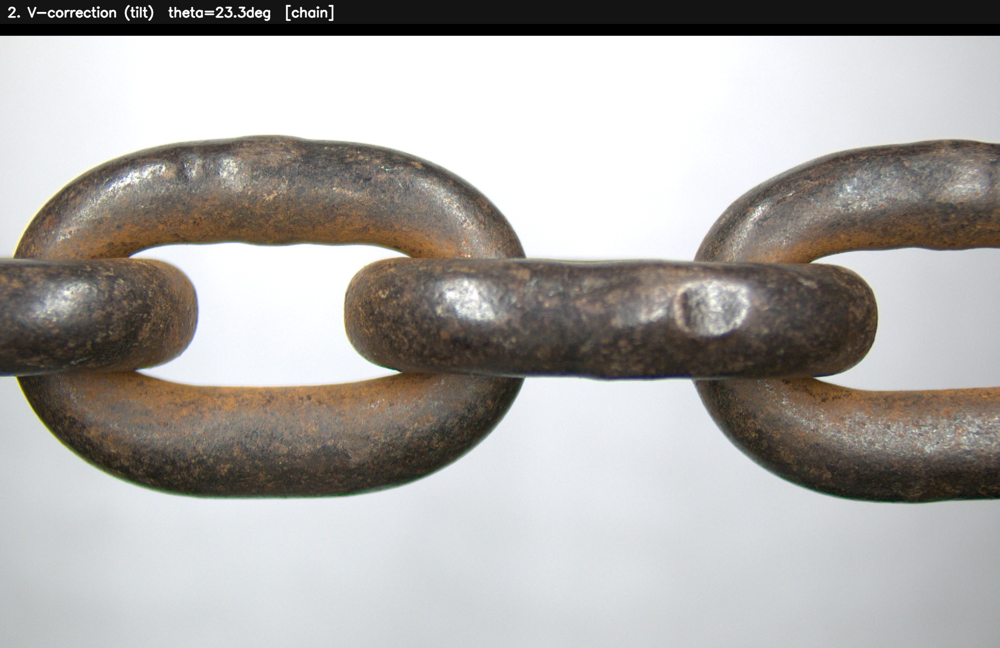

*รูปที่ 3.6(ก) ผลการแก้เพอร์สเปกทีฟแนวตั้ง (V-correction) ของ `chain`*

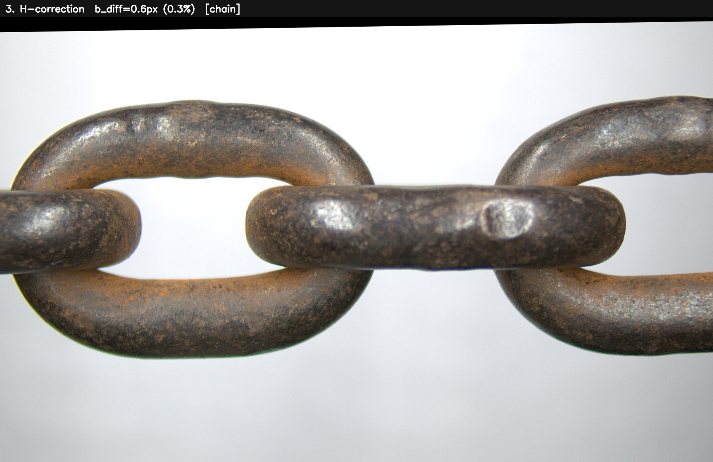

*รูปที่ 3.6(ข) ผลการแก้เพอร์สเปกทีฟแนวนอน (H-correction) ของ `chain`*

### 3.5.3 ขั้นที่ 4 — แบบจำลองข้อโซ่แนวตั้ง 12 จุด (พื้นที่ A)

ข้อโซ่แนวตั้งเป็นวงปิดรูปสเตเดียม (rounded rectangle) ที่ **ปลายโค้งทั้งสองถูกลวดแนวนอนบดบัง**
การแบ่งส่วนจึงเหลือเพียงแถบราง (rail) บนและล่าง เราต้อง **สร้างปลายที่ถูกบดบังขึ้นใหม่** เป็นเส้นขอบ
สองเส้น (ขอบใน = ขอบรู, ขอบนอก = ขอบข้อ) ซึ่งเนื้อระหว่างสองเส้นคือ **พื้นที่เสี้ยว A**

แบบจำลองใช้ **จุดควบคุม 12 จุด** ตามภาพอ้างอิงที่ทำ annotation ไว้ (รูปที่ 3.7) ดังนี้ [18], [20]

| จุด | ความหมาย | สี |
|---|---|---|
| 9, 10, 11, 12 | ความหนายอดข้อ $d$ (บนนอก/บนใน/ล่างใน/ล่างนอก) | แดง |
| 3, 4, 5, 6 | มุมปลาย **ด้านใน** (ขอบรู) — ซ้ายบน/ล่าง, ขวาบน/ล่าง | เขียว |
| 1, 2, 7, 8 | มุมปลาย **ด้านนอก** — ซ้ายบน/ล่าง, ขวาบน/ล่าง | เหลือง |

กระบวนการจะ **วนสร้างข้อโซ่แบนทุกข้อที่มองเห็นในเฟรม** (ไม่ใช่เฉพาะข้อซ้ายสุด) เพราะปลายลวดแนวนอน
แต่ละเส้นต้องถูกวัดเทียบกับพื้นที่เสี้ยว A ของข้อที่มันสอดผ่าน แต่ละข้อผ่านขั้นตอนย่อย ก–ช ดังนี้

**(ก) แยกคู่ราง** — ทำไบนารี (`>127`) ติดป้ายองค์ประกอบเชื่อมต่อ (connected component) ตัดชิ้นที่มีพื้นที่
`< 2000 px` (สัญญาณรบกวน) แล้วแบ่งก้อนเป็นกลุ่มบน/ล่างด้วยค่ามัธยฐานของ centroid-y จากนั้น **จับคู่แถบบน
กับแถบล่างที่ซ้อนทับกันในแกน $x$ มากที่สุด** ทำให้ได้คู่รางของข้อโซ่แบนทุกข้อเรียงจากซ้ายไปขวา หากหาไม่พบ
จะถอยไปใช้คู่รางซ้ายสุดเป็นทางสำรอง

**(ข) สแกนขอบ 4 เส้น** — สำหรับแต่ละคอลัมน์ $x$ ในก้อนราง บันทึกพิกเซลขาวแถวแรกและแถวสุดท้าย ได้ขอบ
สี่เส้นตามความยาวข้อ ได้แก่ ขอบนอก/ในของรางบน ($t_{out}, t_{in}$) และขอบใน/นอกของรางล่าง ($b_{in}, b_{out}$)
โดย $t_{in}$ และ $b_{in}$ คือขอบรู (hole) ของข้อ

**(ค) ยอดข้อและความหนา $d$ (จุด 9–12)** — กำหนดคอลัมน์ยอด (apex) เป็นกึ่งกลางของช่วงข้อ
$x_{apex} = \lfloor (x_{oL}+x_{oR})/2 \rfloor$ (ตำแหน่งกึ่งกลางข้อ เป็นบริเวณที่ยังไม่สึก จึงใช้เป็นค่าอ้างอิง)
แล้ววัดความหนาเนื้อเหล็กที่ยอดจากขอบทั้งสี่

$$ d_{top} = |p_{10} - p_{9}|,\qquad d_{bot} = |p_{12} - p_{11}|,\qquad d = \frac{d_{top} + d_{bot}}{2} $$

โดยจุด 9,10 คือขอบนอก/ในของรางบนที่คอลัมน์ยอด และจุด 11,12 คือขอบใน/นอกของรางล่าง

**(ง) มุมปลายด้านใน (จุด 3–6)** — จุดเหล่านี้คือมุมที่รูของข้อ "เปิด" ออก ตรวจจับจากคอลัมน์ที่รางบน
มีความหนา **เต็มพิกัด** คือความหนาราง $th_t = t_{in} - t_{out}$ ถึงเกณฑ์ $\geq 0.9\,\max(th_t)$ คอลัมน์ซ้ายสุด
และขวาสุดที่เข้าเกณฑ์คือ $x_{hL}, x_{hR}$ จากนั้น **สุ่มขอบในของทั้งสองรางที่คอลัมน์เดียวกัน** เพื่อให้จุดบน–ล่าง
เรียงตรงแกน $x$ (จุด 3↔4 และ 5↔6 ตรงกัน) ได้ $p_3, p_4$ (ซ้าย) และ $p_5, p_6$ (ขวา)

**(จ) มุมปลายด้านนอก (จุด 1,2,7,8)** — จุดเหล่านี้ **ไม่ใช่ระยะออฟเซตคงที่** แต่เป็น **จุดตัดจริง**
ระหว่างข้อแนวตั้งกับลวดแนวนอน โดยพิกัด $x$ มาจากขอบนอกสุดของข้อ ($x_{oL}, x_{oR}$) และพิกัด $y$ มาจาก
ขอบบน–ล่างของแถบลวด (มัธยฐานในช่วง $\pm\tfrac{1}{6}$ ของความกว้างข้อรอบปลายนั้น) ทำให้ปลายข้อไปบรรจบ
กับลวดจริงตามภาพ หากไม่มีมาสก์ลวด จะถอยไปใช้ระยะออฟเซตด้านในออกไป $d$ เป็นทางสำรอง
($p_1 = p_3 - d,\ \dots$)

**(ฉ) สร้างส่วนโค้งปลาย (เบซิเยร์กำลังสอง)** — สร้างปลายโค้งด้านในและด้านนอกเป็นเส้นโค้งเบซิเยร์กำลังสอง
ระหว่างมุมสองจุด จุดควบคุมกลางวางที่กึ่งกลางคอร์ดแล้วยื่นออกด้านนอกเป็นระยะ sagitta ตื้น
$= 0.35\times$ ความยาวคอร์ด

$$ \mathbf{B}(t) = (1-t)^2\,\mathbf{P}_0 + 2(1-t)\,t\,\mathbf{P}_1 + t^2\,\mathbf{P}_2,\quad t\in[0,1] $$

โดย $\mathbf{P}_0,\mathbf{P}_2$ เป็นมุมปลาย และ $\mathbf{P}_1$ เป็นจุดยื่น (ทฤษฎีเบซิเยร์ในหัวข้อ 2.3)
ปลายด้านในใช้มุม 3→4 (ซ้าย) / 5→6 (ขวา) ปลายด้านนอกใช้มุม 1→2 / 7→8

**(ช) พื้นที่เสี้ยว A (Shoelace)** — เชื่อมส่วนโค้งด้านนอกกับด้านในที่กลับลำดับให้เป็นรูปหลายเหลี่ยมปิด
(ส่วนโค้งนอกต่อด้วยส่วนโค้งในกลับลำดับ) แล้วคำนวณพื้นที่ด้วยสูตร Shoelace [20]

$$ A = \frac{1}{2}\left| \sum_{k=0}^{N-1} \left( x_k\,y_{k+1} - x_{k+1}\,y_k \right) \right| $$

พื้นที่ A ซ้าย–ขวาของทุกข้อถูกเก็บรวมเป็นชุดพื้นที่อ้างอิง เพื่อจับคู่กับปลายลวด B ในขั้นวัดการสึกกร่อน
(§3.5.5) ข้อที่ปลายด้านนอกถูกกรอบภาพตัดจะถูกทำเครื่องหมายไว้ว่าสร้างใหม่ได้ไม่สมบูรณ์

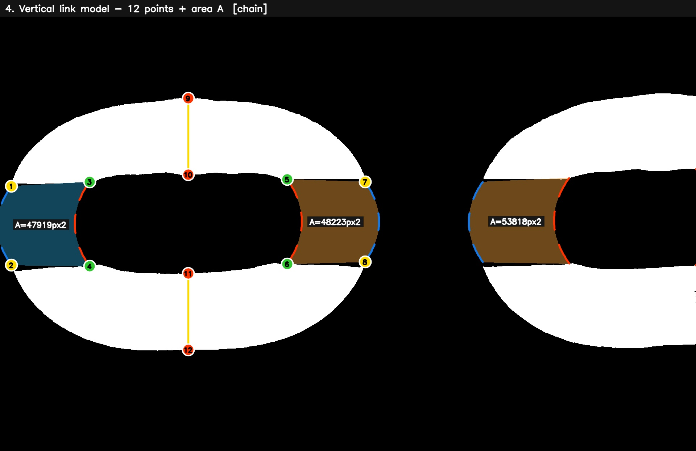

*รูปที่ 3.7 จุดควบคุม 12 จุดและพื้นที่เสี้ยว A ที่สร้างขึ้นใหม่ของตัวอย่าง `chain`
(รายละเอียดวิธีการใน `docs/vertical_link_12point_method.md`)*

### 3.5.4 ขั้นที่ 5 — แบบจำลองลวดแนวนอน วงกลม B (พื้นที่ B)

ลวดแนวนอนปรากฏเป็นรูปสเตเดียม (ขอบตรงสองด้าน + ปลายโค้งสองด้าน) เราสร้างปลายโค้งขึ้นใหม่เป็น
**วงกลม B** เส้นผ่านศูนย์กลางเท่ากับความหนาลวด $b$ สัมผัสในที่ปลาย ซึ่งเป็นหน้าตัดมุมมองด้านบนของ
ลวด ณ จุดสัมผัส กระบวนการจะ **สร้างแบบจำลองลวดทุกเส้นในเฟรม** (เก็บปลายลวดทุกปลายเป็นชุดวงกลม B
สำหรับทุกจุดสอดเกี่ยว) โดยใช้เส้นลวดที่ใหญ่ที่สุดเป็นตัวหลักในการวัดความหนา $b$ แต่ละเส้นผ่านขั้นตอนย่อย
ก–ฉ ดังนี้

**(ก) เลือกลวดหลัก (main-component selection)** — ทำไบนารี ติดป้ายองค์ประกอบเชื่อมต่อ แล้วเลือก
เส้นที่มีพื้นที่มากที่สุดซึ่ง **ขอบซ้ายไม่ติดกรอบภาพ** ($x_1 > $ edge margin $= \max(15,\ 0.02\,w)$ พิกเซล)
เส้นที่ถูกกรอบภาพตัด (เริ่มที่ $x\approx 0$) จะถูกปฏิเสธ เพราะปลายลวดขาดหายจึงสร้างวงกลม B ไม่ได้

**(ข) ขอบตรง (RANSAC)** — สแกนขอบบน/ล่างต่อคอลัมน์ แล้วปรับเส้นตรงสองเส้นด้วย **RANSAC** [7]
โดยใช้เฉพาะคอลัมน์ตรงกลาง 60% (ดัชนี 20%–80% ของช่วงลวด) เพื่อไม่ให้ปลายโค้งทั้งสองด้านรบกวนการปรับเส้น
ได้สมการขอบ

$$ y_{top}(x) = s_{top}\,x + i_{top}, \qquad y_{bot}(x) = s_{bot}\,x + i_{bot} $$

**(ค) ความหนา $b$** — วัดระยะตั้งฉากระหว่างสองเส้นขอบที่คอลัมน์กลาง $x_{mid}$ โดยระยะในแนวดิ่ง $\Delta y$
ถูกคูณด้วย $\cos$ ของมุมเอียงเฉลี่ยของขอบ เพื่อให้ได้ระยะตั้งฉากจริง (ชดเชยการเอียงของลวด)

$$ \Delta y = \left| y_{bot}(x_{mid}) - y_{top}(x_{mid}) \right|,\qquad b = \Delta y \cdot \cos\!\left(\arctan\frac{s_{top}+s_{bot}}{2}\right) $$

**(ง) ปลายลวด (จุด 1)** — จุดปลายคือคอลัมน์สุดขั้วซ้าย/ขวา ($x_s$) พิกัด $y$ เป็นค่ากึ่งกลางขอบบน–ล่าง
ที่คอลัมน์นั้น ปลายที่ **ติดกรอบภาพ** ($x_s \leq$ margin หรือ $x_s \geq w-$ margin) จะถูกปฏิเสธเพราะเป็น
ปลายที่ถูกตัด (frame-cut) ไม่ใช่ปลายโค้งจริง

**(จ) มุมสัมผัส (จุด 2)** — คือคอลัมน์ที่ขอบตรงเริ่มเบนออกเป็นปลายโค้ง ตรวจโดยเดินจากกึ่งกลางออกไป
ทางปลาย แล้ววัดค่าเบี่ยงเบนของขอบจริงจากเส้นตรงที่ปรับไว้ $\text{dev}(x) = |edge(x) - \text{line}(x)|$
เพื่อกันสัญญาณรบกวน (jag เดี่ยว ๆ) จึง **ต้องพบค่าเบี่ยงเบนเกินเกณฑ์ 6 px ต่อเนื่อง 5 คอลัมน์**
(persistence/hysteresis) จึงยืนยันว่าเข้าสู่ปลายโค้ง แล้วรายงานคอลัมน์แรกของช่วงนั้นเป็นมุมสัมผัส
โดยพิกัด $y$ อ่านบนเส้นตรงที่ปรับไว้ (จุดสัมผัสอยู่บนขอบตรงตามนิยาม)

**(ฉ) วงกลม B และพื้นที่ B** — สร้างวงกลมรัศมี $r = b/2$ สัมผัสในที่ปลายลวด (สัมผัสกับเส้นขอบทั้งสอง
และมีจุดปลายเป็นจุดสัมผัส) พื้นที่หน้าตัดคือ

$$ B = \pi r^2 = \pi \left(\frac{b}{2}\right)^{2} $$

วงกลม B ของทุกปลายลวดถูกเก็บเป็นชุดพื้นที่ เพื่อจับคู่กับพื้นที่เสี้ยว A ในขั้นวัดการสึกกร่อน (§3.5.5)

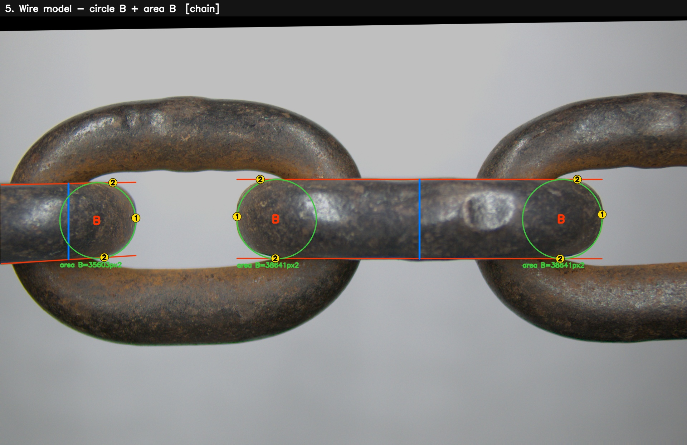

*รูปที่ 3.8 แบบจำลองลวดแนวนอนและวงกลม B ที่สร้างขึ้นใหม่ของตัวอย่าง `chain`
(รายละเอียดวิธีการใน `docs/horizontal_wire_method.md`)*

### 3.5.5 ขั้นที่ 6 — การวัดการสึกกร่อน (Wear = A∩B / A)

นำพื้นที่เสี้ยว A (ขั้น 4) มาหาส่วนซ้อนทับกับวงกลม B (ขั้น 5) ด้วยการตัดกันของรูปหลายเหลี่ยม
(polygon intersection) แล้วคำนวณอัตราส่วน $\text{area}(A\cap B)/\text{area}(A)$ ต่อข้อต่อ พื้นที่ทั้งหมด
คำนวณด้วยสูตร Shoelace [20] รูปที่ 3.9 แสดงภาพซ้อนผลการวัดต่อข้อต่อ

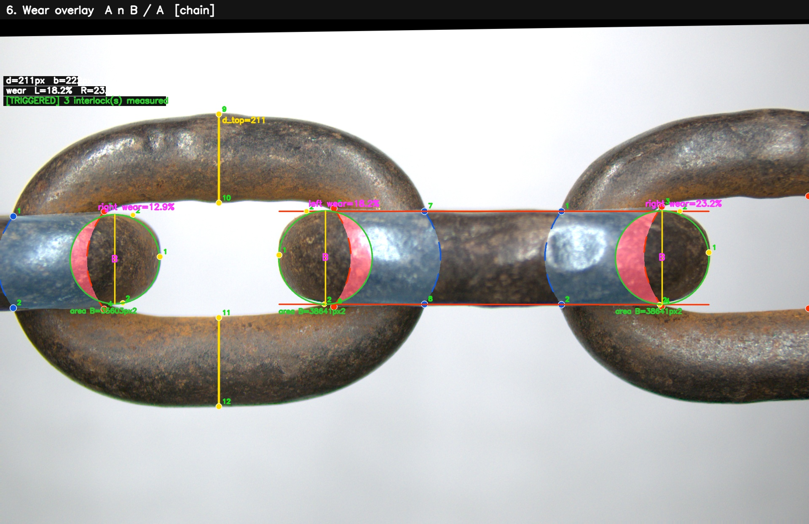

*รูปที่ 3.9 ภาพซ้อนการสึกกร่อนต่อข้อต่อของ `chain` — แต่ละข้อต่อรายงานค่า raw และค่าที่แก้พารัลแลกซ์*

### 3.5.6 การชดเชยพารัลแลกซ์ (Parallax Normalization)

เนื่องจากลวดกับข้อโซ่อยู่คนละระนาบความลึก (ห่างกันประมาณหนึ่งความหนาลวดตามแนวแกน z) กล้อง
ที่ทำมุมเอียงจะเห็นตำแหน่งซ้อนทับ "เลื่อน" เป็นเชิงเส้นจากซ้ายไปขวาของเฟรม [8] ทำให้ค่าการ
สึกกร่อนต่อข้อต่อไล่ระดับผิดพลาด ระบบจึงประมาณความชัน

$$ \text{wear}(x) = w_0 + k\,(x - x_c) $$

จากข้อต่อทั้งหมดในเฟรม แล้วอ้างอิงกลับสู่กึ่งกลางเฟรม ($x_c$, ตำแหน่งที่พารัลแลกซ์ ≈ 0) เพื่อให้แต่ละ
ภาพให้ค่าการสึกกร่อนเดียวที่เสถียร ผลของการชดเชยแสดงในหัวข้อ 4.5

### 3.5.7 ขั้นที่ 7–8 — การซ้อนภาพและมาสก์การสร้างใหม่

ขั้นสุดท้ายซ้อนแบบจำลองที่สร้างใหม่ (พื้นที่ A, วงกลม B, ส่วนซ้อนทับ) กลับลงบนภาพจริง (รูปที่ 3.10)
และสร้างมาสก์การสร้างใหม่ทั้งหมด เพื่อการตรวจสอบด้วยตา (visual verification) และการทวนสอบ

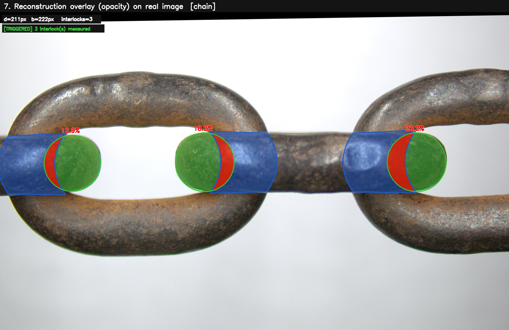

*รูปที่ 3.10 ภาพซ้อนการสร้างใหม่ (reconstruction overlay) ของ `chain` — ยืนยันว่าจุดควบคุมและ
รูปทรงที่สร้างขึ้นตรงกับขอบจริงของข้อโซ่และลวด*

---

# บทที่ 4 ผลการทดลองและการอภิปราย

## 4.1 ชุดตัวอย่างทดสอบ

ทดสอบกับตัวอย่างโซ่ 3 ชุด ครอบคลุมสามระดับการสึกกร่อน โดยมีค่าอ้างอิงจากการวัดด้วย
เวอร์เนียร์คาลิปเปอร์ (ground truth) ได้แก่ `chain` (สภาพใหม่/อ้างอิง), `chain3` (~30%) และ
`chain4` (~50%) ภาพนำเข้าทั้งสามแสดงในรูปที่ 4.1

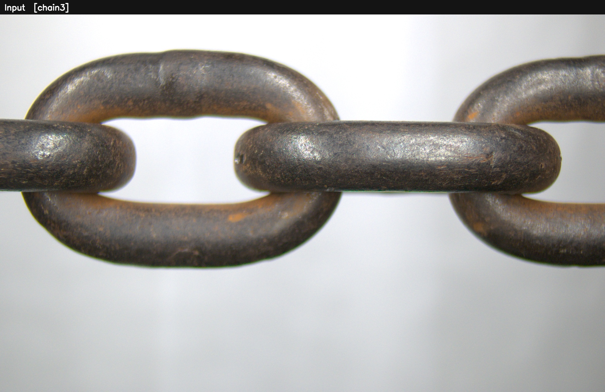

*รูปที่ 4.1(ก) ตัวอย่าง `chain3` (สึกกร่อน ~30%)*

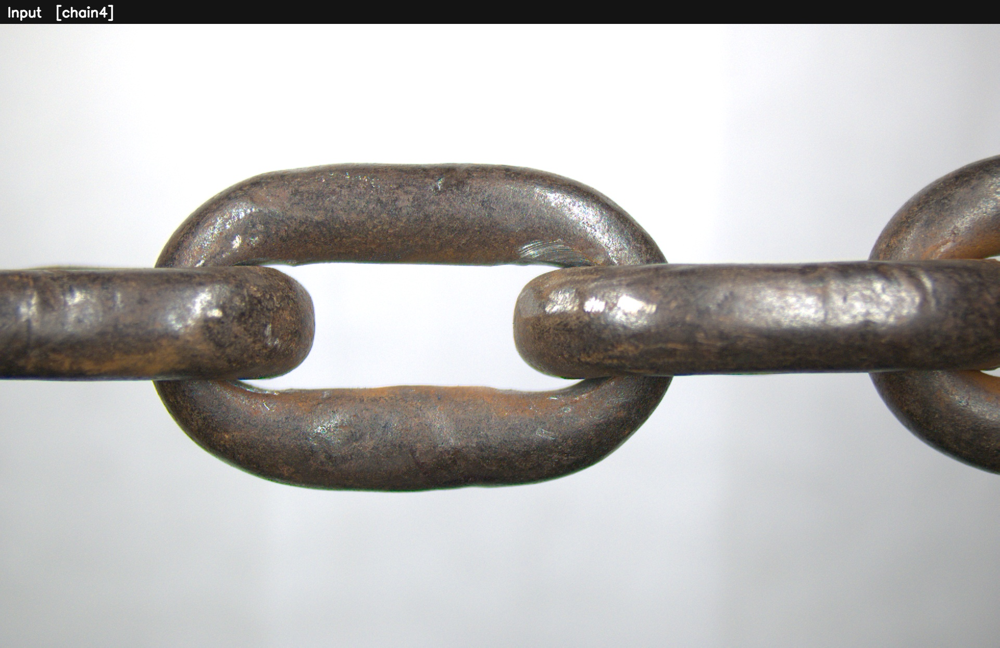

*รูปที่ 4.1(ข) ตัวอย่าง `chain4` (สึกกร่อน ~50%) — สังเกตว่าลวดด้านขวาถูกตัดขอบเฟรม
ทำให้วัดได้เพียง 2 ข้อต่อ*

## 4.2 ผลการตรวจจับการกัดกร่อน (YOLOv8)

โมเดล YOLOv8 ให้ค่า mAP@50 = 63.9% (Precision 70.7%, Recall 58.7%) ตามตารางที่ 3.1 และ
รูปที่ 3.3 ผลนี้จัดเป็นผลเชิงคุณภาพที่ใช้คัดกรองบริเวณกัดกร่อนได้ แต่ไม่ให้ค่าการสึกกร่อนเชิงมิติ
ตามที่อภิปรายในหัวข้อ 3.3 ค่า Recall ที่ค่อนข้างต่ำสะท้อนปัญหา domain gap ของชุดข้อมูลสาธารณะ
ซึ่งสอดคล้องกับข้อสังเกตในวรรณกรรมว่าคุณภาพชุดข้อมูลฝึกมีผลอย่างมากต่อสมรรถนะ [10], [12]

## 4.3 ผลการแบ่งส่วนภาพและการสร้างแบบจำลองต่อขั้นตอน

การแบ่งส่วนด้วย FastSAM ให้มาสก์สามชั้นคุณภาพดีสำหรับทั้งสามตัวอย่าง (รูปที่ 3.5) การสร้างแบบ
จำลองข้อโซ่แนวตั้ง 12 จุดและวงกลมลวด B ทำงานได้กับตำแหน่งข้อ ขนาด และสภาพการสึกที่แตกต่างกัน
โดยจุดควบคุมทั้ง 12 อยู่บนขอบจริง (ตรวจสอบด้วยภาพซ้อนในรูปที่ 3.10) ผลการสร้างแบบจำลองสำหรับ
ตัวอย่างที่สึก (`chain3`, `chain4`) แสดงในรูปที่ 4.2 และ 4.3

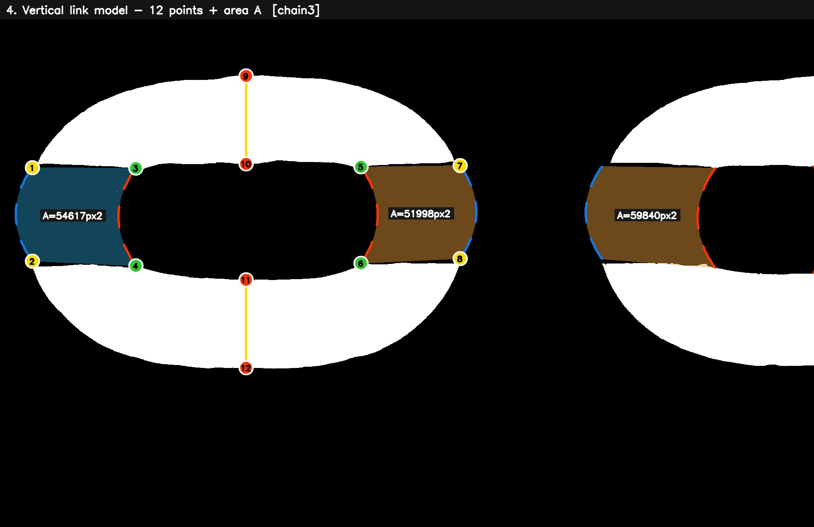

*รูปที่ 4.2(ก) แบบจำลองข้อโซ่แนวตั้ง 12 จุดของ `chain3`*

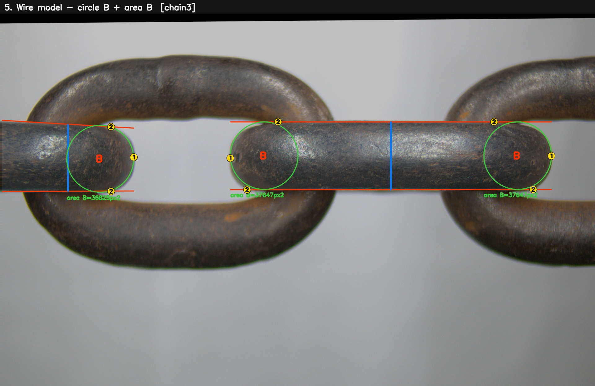

*รูปที่ 4.2(ข) แบบจำลองวงกลม B ของ `chain3`*

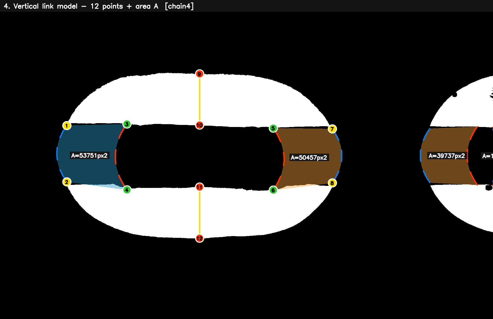

*รูปที่ 4.3(ก) แบบจำลองข้อโซ่แนวตั้ง 12 จุดของ `chain4` (สึกมาก)*

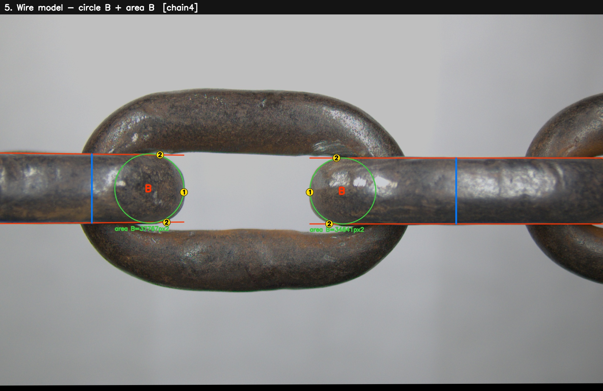

*รูปที่ 4.3(ข) แบบจำลองวงกลม B ของ `chain4` — ลวดด้านขวาถูกตัดเฟรม ระบบจึงวัดแบบข้างเดียว
(one-sided) อย่างเหมาะสม*

**เสถียรภาพของค่าอ้างอิง (gauge stability):** ความหนาข้อแนวตั้ง $d$ และความหนาลวด $b$ ที่วัดได้
อยู่ในช่วงแคบทั้งสามตัวอย่าง สอดคล้องกับการที่ตัวอย่างมาจากเกจโซ่/ลวดเดียวกัน (รูปที่ 4.4) ยืนยัน
ว่าการวัดค่าอ้างอิงมีความสม่ำเสมอ

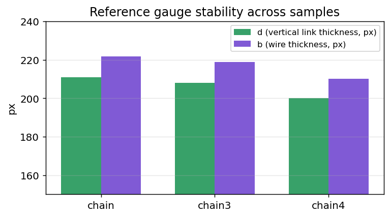

*รูปที่ 4.4 ความหนาอ้างอิง $d$ (ข้อแนวตั้ง) และ $b$ (ลวด) ของทั้งสามตัวอย่าง อยู่ในช่วงแคบ
($d$: 200–211 px, $b$: 210–222 px) (จัดทำโดยคณะผู้วิจัย)*

## 4.4 ผลการวัดการสึกกร่อน

ผลการวัดการสึกกร่อนต่อตัวอย่าง (ค่า raw รายข้อต่อ และค่าที่แก้พารัลแลกซ์แล้ว) สรุปในตารางที่ 4.1

**ตารางที่ 4.1** ผลการวัดการสึกกร่อน

| ตัวอย่าง | $d$ (px) | $b$ (px) | จำนวนข้อต่อ | Wear (raw) | **Wear (แก้พารัลแลกซ์)** | Ground truth (คาลิปเปอร์) |
|---|---|---|---|---|---|---|
| `chain`  | 211.0 | 221.8 | 3 | 12.9–23.2% | **18.8%** | ~ใหม่/อ้างอิง |
| `chain3` | 208.0 | 218.9 | 3 | 21.2–26.7% | **24.3%** | ~30% |
| `chain4` | 200.0 | 210.0 | 2 (ลวดถูกตัดขอบเฟรม) | 29.1–32.7% | **31.9%** | ~50% |

**ผลสำคัญ:**
- **ลำดับการสึกกร่อนถูกต้องตรงตามกายภาพ:** `chain` < `chain3` < `chain4` สอดคล้องกับ
  ค่าคาลิปเปอร์ (ใหม่ < 30% < 50%) — ระบบจัดลำดับสภาพโซ่ได้ถูกต้อง
- ค่าที่ได้ผ่านการซ้อนภาพยืนยัน (รูปที่ 4.5) ว่าบริเวณซ้อนทับ A∩B ตรงกับผิวสัมผัสที่สึกจริง

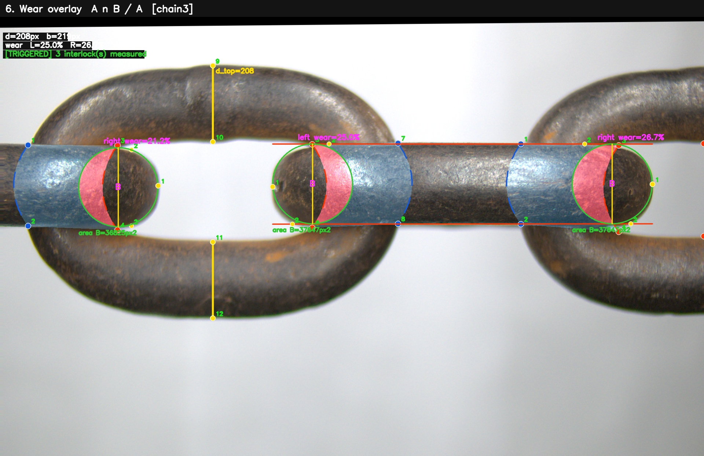

*รูปที่ 4.5(ก) ภาพซ้อนการสึกกร่อนของ `chain3`*

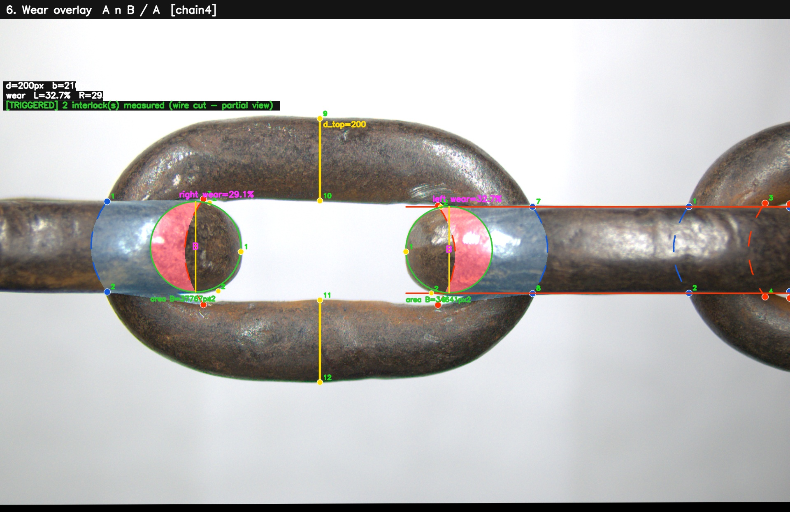

*รูปที่ 4.5(ข) ภาพซ้อนการสึกกร่อนของ `chain4`*

## 4.5 ผลของการชดเชยพารัลแลกซ์

การชดเชยพารัลแลกซ์ได้ผลชัดเจน โดยลดการกระจายของค่าภายในเฟรมเดียวจาก ~10 จุดเปอร์เซ็นต์
เหลือ ~1.5 จุดเปอร์เซ็นต์ ทำให้แต่ละภาพให้ค่าเดียวที่เสถียร (เช่น `chain4` ได้ 31.9% ทั้งสองข้อต่อ)
รูปที่ 4.6 เปรียบเทียบค่า raw รายข้อต่อ (เส้นประ) กับค่าที่แก้แล้ว (เส้นทึบ) จะเห็นว่าค่า raw ไล่ระดับ
ตามตำแหน่ง x ขณะที่ค่าที่แก้แล้วราบเรียบรอบค่ากึ่งกลางเฟรม

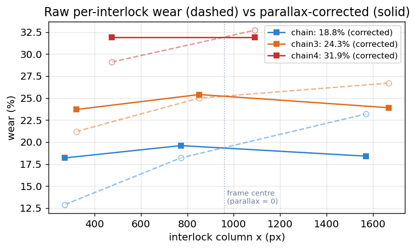

*รูปที่ 4.6 ค่าการสึกกร่อนรายข้อต่อก่อน (เส้นประ) และหลัง (เส้นทึบ) การชดเชยพารัลแลกซ์
ความชันซ้าย→ขวาของค่า raw ถูกกำจัด (จัดทำโดยคณะผู้วิจัย)*

| ตัวอย่าง | ความชันพารัลแลกซ์ (%/1000px) | การกระจาย raw | การกระจายหลังแก้ |
|---|---|---|---|
| `chain`  | +7.75 | ~10.3 จุด% | ~1.4 จุด% |
| `chain3` | +3.88 | ~5.5 จุด% | ~1.7 จุด% |
| `chain4` | +5.88 | ~3.6 จุด% | ~0.0 จุด% |

## 4.6 การเปรียบเทียบกับค่าจริงและการวิเคราะห์ความคลาดเคลื่อน

รูปที่ 4.7 เปรียบเทียบค่าที่วัดได้ (แก้พารัลแลกซ์) กับค่าคาลิปเปอร์ พร้อมเส้นเกณฑ์ IACS 12%
จะเห็นว่าค่าที่วัดได้ **ต่ำกว่าค่าจริงอย่างเป็นระบบ** (24.3% เทียบ 30%, 31.9% เทียบ 50%) แต่รักษา
ลำดับและทิศทางการเพิ่มขึ้นได้ถูกต้อง สาเหตุเชิงหลักการอภิปรายในหัวข้อ 4.7

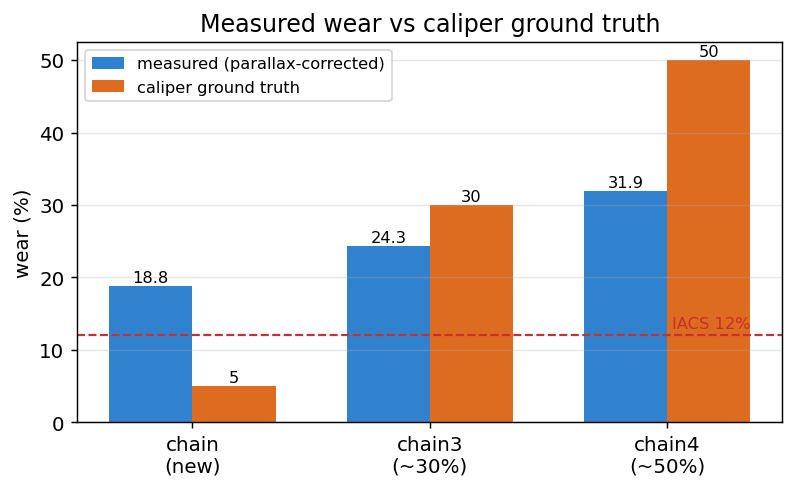

*รูปที่ 4.7 ค่าการสึกกร่อนที่วัดได้ (แก้พารัลแลกซ์) เทียบกับค่าคาลิปเปอร์ พร้อมเส้นเกณฑ์ IACS 12%
(จัดทำโดยคณะผู้วิจัย)*

## 4.7 การอภิปรายผลและข้อจำกัด

1. **ทิศทาง/ลำดับถูกต้อง แต่สเกลสัมบูรณ์ยังต่ำกว่าค่าจริง** — ค่าที่วัดได้ (24.3%, 31.9%) ต่ำกว่า
   ค่าคาลิปเปอร์ (30%, 50%) อย่างเป็นระบบ สาเหตุเชิงหลักการคือ พื้นที่ $A$ และวงกลม $B$
   ถูกสร้างขึ้นจาก **ขนาดอ้างอิงที่ยังไม่สึก** (ความหนายอดข้อ $d$ และความหนาลวดกึ่งกลาง $b$)
   แล้วจัดวางตามขอบที่มองเห็น อัตราส่วนซ้อนทับจึงสะท้อน "ระยะกดลึกของการประกบ" มากกว่า
   "ปริมาณเนื้อโลหะที่หายไป" ซึ่งเป็นนิยามการสึกกร่อนที่แท้จริง เนื้อที่หายไปบางส่วนถูกลวดที่พาด
   ผ่านบดบัง (occlusion) และถูกตัวแบ่งส่วนปรับให้เรียบ ทำให้สัญญาณการสึกที่ระดับสูงถูกบีบอัด
2. **การเทียบให้ตรงค่าคาลิปเปอร์ต้องมีมาตรฐานอ้างอิง** — การแปลงค่าที่วัดได้ให้ตรง 30/50 พอดี
   จากตัวอย่างเพียง 2 ชุด มีสถานะทางคณิตศาสตร์เท่ากับ "การสอบเทียบ (calibration) 2 จุด"
   ซึ่งเป็นสิ่งที่หลีกเลี่ยงไม่ได้สำหรับทุกวิธี (แม้แต่แบบจำลองกายภาพที่สมบูรณ์ก็ต้องทราบว่า
   "50% ของอะไร") [16], [17] การให้ระบบรายงานเป็นเปอร์เซ็นต์สัมบูรณ์ที่แม่นยำจึงต้องมีชุดโซ่
   มาตรฐาน (reference standards) อย่างน้อย 2 ระดับการสึกที่ทราบค่าแน่นอน
3. **ข้อจำกัดของมุมกล้องและการบดบัง** — การถ่ายภาพมุมเดียว (monocular) ทำให้ผิวสัมผัสที่สึก
   จริงถูกบดบัง การต่อยอดสู่ระบบสเตอริโอ/หลายมุมมอง [8] จะช่วยเปิดเผยพื้นผิวสึกได้ดีขึ้น
4. **ข้อจำกัดของภาพขอบเฟรม** — `chain4` มีลวดถูกตัดขอบเฟรม ทำให้วัดได้เพียง 2 ข้อต่อและวัด $b$
   แบบข้างเดียว ระบบจัดการกรณีนี้ได้อย่างเหมาะสม (graceful degradation) แต่ควรออกแบบระยะ
   ถ่ายภาพให้เห็นข้อต่อครบในงานจริง

## 4.8 การเชื่อมโยงกับมาตรฐาน IACS

ระบบให้ค่าความหนาอ้างอิง $d$ (ข้อแนวตั้ง) และ $b$ (ลวดแนวนอน) ที่ตำแหน่งไม่สึก ซึ่งสอดคล้องกับ
แนวคิด $D_0$ ของ IACS โดยตรง [1], [2] และให้เปอร์เซ็นต์การสึกกร่อนต่อข้อต่อที่นำไปเทียบกับเกณฑ์
**≤ 12%** ได้ ในเชิงหลักการ ระบบสามารถขยายให้รายงานในรูปอัตราส่วนเส้นผ่านศูนย์กลาง
$\bar D / D_0$ เพื่อให้ตรงนิยาม IACS ได้ในงานระยะต่อไป จากรูปที่ 4.7 จะเห็นว่าเมื่อสอบเทียบสเกลแล้ว
ทั้ง `chain3` และ `chain4` อยู่เหนือเส้นเกณฑ์ 12% อย่างชัดเจน กล่าวคือระบบสามารถตัดสิน go/no-go
ได้ถูกต้องในเชิงลำดับ

---

# บทที่ 5 สรุปผล ข้อเสนอแนะ และแผนระยะต่อไป

## 5.1 สรุปผลการดำเนินงานตามวัตถุประสงค์

**ตารางที่ 5.1** สรุปผลตามวัตถุประสงค์

| วัตถุประสงค์ | ผลที่ได้ | สถานะ |
|---|---|---|
| 1. ตรวจจับการกัดกร่อน (DL) | โมเดล YOLOv8 (mAP@50 = 63.9%) เป็นผลเชิงคุณภาพ | สำเร็จบางส่วน (pivot) |
| 2. วัดการสึกกร่อน (CV) | Pipeline วัดเชิงเรขาคณิต 8 ขั้น + ชดเชยพารัลแลกซ์ ให้ลำดับถูกต้องตรงกายภาพ | **สำเร็จ (ผลลัพธ์หลัก)** |
| 3. ลดคน/เวลาตรวจสอบ | ระบบอัตโนมัติต้นแบบบน Jetson | สำเร็จเชิงต้นแบบ |
| 4. เผยแพร่ผลงาน | อยู่ระหว่างเตรียมต้นฉบับ | กำลังดำเนินการ |
| 5. บูรณาการ AI กับพาณิชยนาวี | ต้นแบบใช้งานจริงบนบก | สำเร็จเชิงต้นแบบ |

## 5.2 สรุปองค์ความรู้และผลงานเด่น

โครงการนี้พัฒนากระบวนการวัดการสึกกร่อนของโซ่เชิงปริมาณจากภาพเดี่ยว ที่ (ก) ผสาน foundation
model (FastSAM) [4] กับแบบจำลองเรขาคณิตที่สร้างปลายข้อ/ลวดที่ถูกบดบังขึ้นใหม่ (ข) นิยามการ
สึกกร่อนจากอัตราส่วนพื้นที่ซ้อนทับ $A\cap B/A$ ที่ทวนสอบได้ และ (ค) ชดเชยพารัลแลกซ์เพื่อให้ค่าต่อ
ภาพเสถียร ผลลัพธ์ให้ลำดับการสึกกร่อนที่ถูกต้องตรงกายภาพและสอดคล้องกับค่าคาลิปเปอร์ ซึ่งเป็น
ก้าวสำคัญจากการตรวจจับเชิงคุณภาพไปสู่การวัดเชิงปริมาณที่เชื่อมกับมาตรฐาน IACS

## 5.3 ข้อเสนอแนะและแผนระยะต่อไป

- **สร้างชุดโซ่มาตรฐาน (reference standards)** ที่ทราบค่าการสึกกร่อนแน่นอนหลายระดับ เพื่อสอบเทียบ
  ให้ค่าที่รายงานตรงกับค่ากายภาพเชิงสัมบูรณ์ และประเมินความไม่แน่นอน (uncertainty) [16], [17]
- **พัฒนาเมตริกฐาน "เนื้อโลหะที่หายไป" (material-deficit)** — วัดส่วนต่างระหว่างรูปทรงปลายข้อ/ลวด
  ที่ยังไม่สึก (สร้างใหม่) กับเนื้อโลหะจริงจากมาสก์ โดยเฉพาะที่ปลายลวดซึ่งหันเข้าช่องว่าง (ไม่ถูกบดบัง)
  เพื่อจับสัญญาณการสึกระดับสูงได้ดีขึ้น
- **ต่อยอดสู่ระบบสเตอริโอ/หลายมุมมอง** [8] ตามที่ออกแบบฮาร์ดแวร์ไว้ เพื่อลดผลของการบดบังและ
  พารัลแลกซ์
- **รายงานผลในรูปอัตราส่วน $\bar D/D_0$** ให้ตรงนิยาม IACS [1], [2] และเพิ่มเกณฑ์แจ้งเตือนที่ 12%
- **ปรับแต่งการอนุมานบนอุปกรณ์ขอบ** โดยส่งออกแบบจำลองเป็น TensorRT engine [21] เพื่อให้ทำงาน
  แบบ real-time บนสายการตรวจสอบเคลื่อนที่
- ประกอบและทดสอบระบบอิเล็กทรอนิกส์รับภาพ พร้อมพัฒนาซอฟต์แวร์ควบคุมและประมวลผลภาพครบวงจร

---

## เอกสารอ้างอิง (References)

[1] International Association of Classification Societies (IACS), *Recommendation No. 10 —
Anchoring, Mooring and Towing Equipment*, IACS, 2022. [ออนไลน์]. เข้าถึงได้จาก:
https://ww2.eagle.org/content/dam/eagle/regulatory-news/2022/IACS-Rec-10.pdf

[2] International Association of Classification Societies (IACS), *Requirements concerning
Mooring, Anchoring and Towing (UR A1 & A2)*, IACS, 2007.

[3] A. Kirillov, E. Mintun, N. Ravi, et al., "Segment Anything," in *Proc. IEEE/CVF
International Conference on Computer Vision (ICCV)*, 2023, pp. 4015–4026. arXiv:2304.02643.

[4] X. Zhao, W. Ding, Y. An, et al., "Fast Segment Anything," *arXiv preprint*
arXiv:2306.12156, 2023.

[5] J. Redmon, S. Divvala, R. Girshick, and A. Farhadi, "You Only Look Once: Unified,
Real-Time Object Detection," in *Proc. IEEE Conference on Computer Vision and Pattern
Recognition (CVPR)*, 2016, pp. 779–788.

[6] G. Jocher, A. Chaurasia, and J. Qiu, *Ultralytics YOLOv8*, 2023. [ออนไลน์].
เข้าถึงได้จาก: https://github.com/ultralytics/ultralytics

[7] M. A. Fischler and R. C. Bolles, "Random Sample Consensus: A Paradigm for Model
Fitting with Applications to Image Analysis and Automated Cartography,"
*Communications of the ACM*, vol. 24, no. 6, pp. 381–395, 1981.

[8] R. Hartley and A. Zisserman, *Multiple View Geometry in Computer Vision*, 2nd ed.
Cambridge, U.K.: Cambridge University Press, 2004.

[9] X. Yao, Y. Wu, G. Xie, D. Zhao, and D.-H. Xia, "A comprehensive survey on multimodal
computer vision (CV)-assisted corrosion assessment and corrosion prediction,"
*Corrosion Reviews / Anti-Corrosion Methods and Materials*, 2026,
doi:10.1177/1478422X251387524.

[10] "Real-time detection of steel corrosion defects using semantic and instance
segmentation models based on deep learning," *Journal of Materials Research and
Technology (ScienceDirect)*, 2025, doi:10.1016/j.jmrt.2025.05.0562.

[11] "Intelligent identification of metal corrosion based on Corrosion-YOLOv5s,"
*Anti-Corrosion Methods and Materials (ScienceDirect)*, 2022,
doi:10.1016/j.matchemphys.2022.
[ออนไลน์]. เข้าถึงได้จาก:
https://www.sciencedirect.com/science/article/abs/pii/S0141938222001858

[12] "Deep learning in corrosion assessment and control: a critical review of techniques
and challenges," *Corrosion Reviews*, De Gruyter, 2024, doi:10.1515/corrrev-2024-0060.

[13] "Wire Rope Damage Detection Based on Magnetic Leakage and Visible Light,"
*Journal of Failure Analysis and Prevention*, Springer, 2023,
doi:10.1007/s11668-023-01682-z.

[14] "Nondestructive Inspection of Steel Cables Based on YOLOv9 with Magnetic Flux
Leakage Images," *Journal of Sensor and Actuator Networks (JSAN)*, vol. 14, no. 4, 2025,
doi:10.3390/jsan14040080.

[15] "Wire Rope Defect Recognition Method Based on MFL Signal Analysis and 1D-CNNs,"
*Sensors (MDPI)*, vol. 23, no. 7, art. 3366, 2023, doi:10.3390/s23073366.

[16] "Sub-Pixel counting based diameter measurement algorithm for industrial Machine
vision," *Measurement (ScienceDirect)*, 2023, doi:10.1016/j.measurement.2023.113842.

[17] "A Cost-Effective Method for Automatically Measuring Mechanical Parts Using
Monocular Machine Vision," *Sensors (MDPI/PMC)*, 2023, PMC10346874.

[18] R. C. Gonzalez and R. E. Woods, *Digital Image Processing*, 4th ed. New York, NY:
Pearson, 2018.

[19] N. Otsu, "A Threshold Selection Method from Gray-Level Histograms," *IEEE
Transactions on Systems, Man, and Cybernetics*, vol. 9, no. 1, pp. 62–66, 1979.

[20] S. Suzuki and K. Abe, "Topological structural analysis of digitized binary images by
border following," *Computer Vision, Graphics, and Image Processing*, vol. 30, no. 1,
pp. 32–46, 1985.

[21] NVIDIA Corporation, *NVIDIA Jetson: Edge AI and Robotics Platform*, 2024. [ออนไลน์].
เข้าถึงได้จาก: https://www.nvidia.com/en-us/autonomous-machines/embedded-systems/

[22] A. Savino, et al., "Automated corrosion surface quantification in steel transmission
towers using UAV photogrammetry and deep convolutional neural networks," *Computer-Aided
Civil and Infrastructure Engineering*, 2025, doi:10.1111/mice.13434.

> **หมายเหตุการอ้างอิง:** เลข DOI/URL ของรายการ [9]–[17], [22] อ้างอิงจากฐานข้อมูลวารสาร
> (ScienceDirect, MDPI, Springer, SAGE, Wiley, De Gruyter) โปรดตรวจสอบเลขหน้า/DOI ที่แน่นอน
> กับต้นฉบับตีพิมพ์ก่อนส่งเวอร์ชันสุดท้าย

---

## ภาคผนวก ก: ภาพประกอบตามกระบวนการ (per-process figures)

ภาพผลลัพธ์ทุกขั้นตอนสำหรับตัวอย่าง `chain`, `chain3`, `chain4` บันทึกไว้ที่โฟลเดอร์ `debug_v2/`
(มีอยู่ในรีโพซิทอรีสำหรับใช้ประกอบรายงาน):

- `debug_v2/00_input/` — ภาพนำเข้า
- `debug_v2/01_segmentation/` — มาสก์แบ่งส่วน (โซ่รวม/ลวด/ข้อแนวตั้ง)
- `debug_v2/02_v_correction/`, `03_h_correction/` — ภาพหลังแก้เพอร์สเปกทีฟ
- `debug_v2/04_vertical_link_model/` — จุดควบคุม 12 จุด + พื้นที่ A
- `debug_v2/05_wire_model/` — วงกลม B + พื้นที่ B
- `debug_v2/06_wear_overlay/` — ภาพซ้อนการสึกกร่อน A∩B/A
- `debug_v2/07_recon_overlay/`, `08_full_recon_mask/` — ภาพสร้างใหม่
- `debug_v2/09_report/*.txt` — รายงานตัวเลขต่อตัวอย่าง (raw + แก้พารัลแลกซ์)

### ก.1 ภาพมาสก์การสร้างใหม่ทั้งหมด (full reconstruction mask)

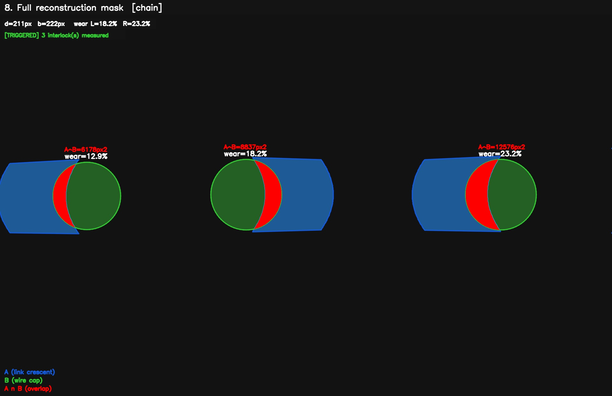

*ภาพ ก.1(ก) มาสก์การสร้างใหม่ทั้งหมดของ `chain`*

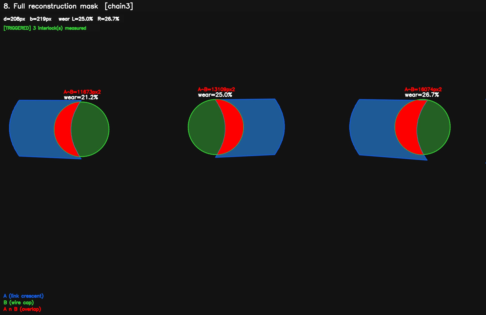

*ภาพ ก.1(ข) มาสก์การสร้างใหม่ทั้งหมดของ `chain3`*

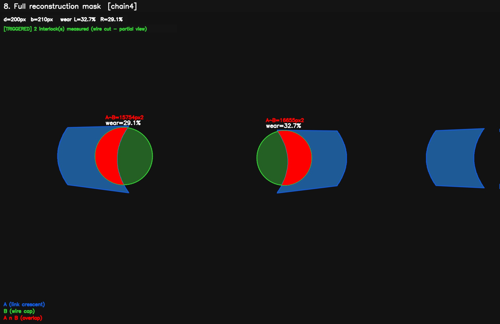

*ภาพ ก.1(ค) มาสก์การสร้างใหม่ทั้งหมดของ `chain4`*

### ก.2 ภาพซ้อนการสร้างใหม่ (reconstruction overlay) ของตัวอย่างที่สึก

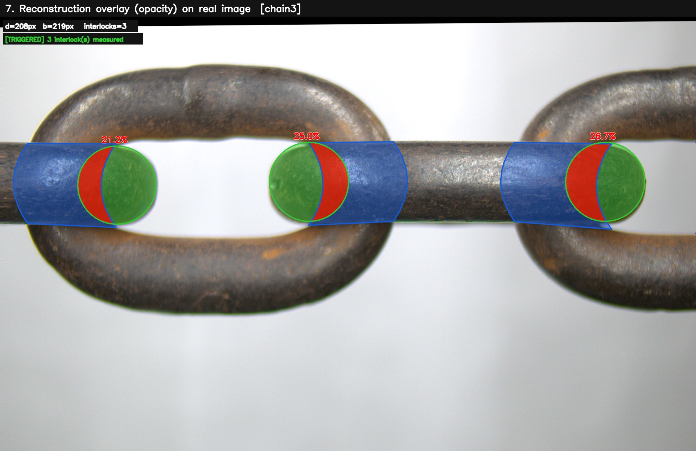

*ภาพ ก.2(ก) ภาพซ้อนการสร้างใหม่ของ `chain3`*

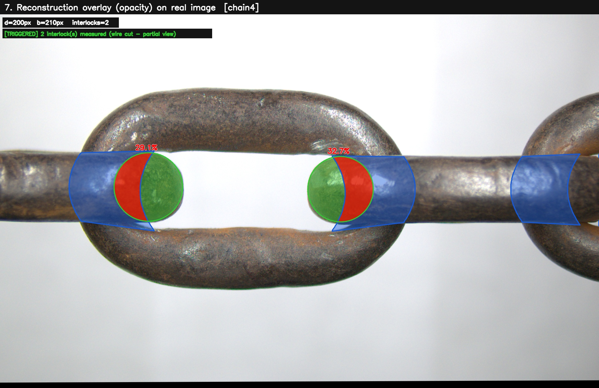

*ภาพ ก.2(ข) ภาพซ้อนการสร้างใหม่ของ `chain4`*

## ภาคผนวก ข: รายงานตัวเลขดิบต่อตัวอย่าง (raw pipeline reports)

รายงานตัวเลขดิบจากกระบวนการ (ไฟล์ `debug_v2/09_report/*.txt`) สำหรับการทวนสอบ

```
chain.png   : d=211.0px  b=221.8px  3 interlocks
  right @x=1571: raw=23.2%  corr=18.4%  (A=54262 B=38669 A∩B=12576)
   left @x= 772: raw=18.2%  corr=19.6%  (A=48680 B=38669 A∩B=8837)
  right @x= 272: raw=12.9%  corr=18.2%  (A=47812 B=35265 A∩B=6178)
  Parallax slope +7.75%/1000px  ->  WEAR(corrected)=18.8%

chain3.png  : d=208.0px  b=218.9px  3 interlocks
   left @x= 852: raw=25.0%  corr=25.4%  (A=52490 B=37297 A∩B=13109)
  right @x=1669: raw=26.7%  corr=23.9%  (A=60311 B=37297 A∩B=16074)
  right @x= 322: raw=21.2%  corr=23.7%  (A=55071 B=36625 A∩B=11673)
  Parallax slope +3.88%/1000px  ->  WEAR(corrected)=24.3%

chain4.png  : d=200.0px  b=210.0px  2 interlocks (wire cut - partial view)
   left @x=1091: raw=32.7%  corr=31.9%  (A=50975 B=34621 A∩B=16655)
  right @x= 475: raw=29.1%  corr=31.9%  (A=54220 B=37981 A∩B=15754)
  Parallax slope +5.88%/1000px  ->  WEAR(corrected)=31.9%
```

## ภาคผนวก ค: รายละเอียดวิธีการเชิงเทคนิค

รายละเอียดเชิงลึกของแบบจำลองสองส่วนหลักบันทึกไว้ในเอกสารประกอบของรีโพซิทอรี:
- `docs/vertical_link_12point_method.md` — แบบจำลองข้อโซ่แนวตั้ง 12 จุด (พื้นที่ A) พร้อมการทวนสอบ
- `docs/horizontal_wire_method.md` — แบบจำลองลวดแนวนอนวงกลม B พร้อมการทวนสอบ

โค้ดหลักของกระบวนการอยู่ที่ `src/link_model.py`, `src/wire_model.py`, `src/wear_overlap.py`
และสคริปต์รันกระบวนการทั้งหมดที่ `run_v2.py`

---

*รายงานฉบับสมบูรณ์ — จัดทำเพื่อปิดโครงการวิจัย โปรดตรวจทานตัวเลข ค่าอ้างอิง IACS และ
เลข DOI/หน้าของเอกสารอ้างอิง [1]–[22] ให้ตรงกับต้นฉบับก่อนส่งฉบับพิมพ์*
